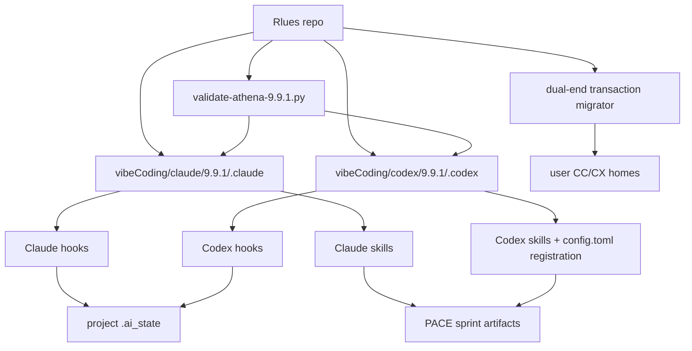
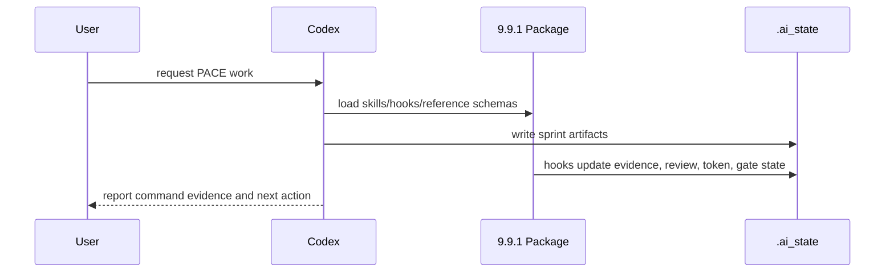

# Rlues Athena Package Architecture

## 一句话

Rlues stores immutable versioned Athena/VibeCoding distribution packages for Claude Code and Codex. `vibeCoding/{claude,codex}/9.9.1` is the current release source; 9.9.0 remains the migration baseline, and installed user-level configs are downstream artifacts.

## CC 9.9.1 contract hardening (2026-07-11, Fable5 review pass1→pass3)

Codex-generated CC 9.9.1 passed a Fable5 post-implementation review that reworked four fail-open/contract defects the 143-test suite missed (fixtures had systematically avoided the triggering input shapes):

- **delivery-gate finalVerdict**: strips inline `*` before matching, so the evaluator's own `**判定**: PASS` template parses (was permanently blocking legit PASS).
- **pre-bash-guard**: structural tokenizer now recurses into `$(...)`/backtick command substitution and normalizes `rm` glob targets (`/*`, `//`, `/.`) — closing push/destructive-command bypasses; `#` comments treated inert. Known static-analysis edges (`eval $VAR`, `<(...)`) documented in RELEASE.md, defended in depth by delivery-gate + permissions.
- **PreCompact matcher**: `manual|auto` (official trigger values) — was `agent_needs_input|agent_completed`, which never fired, silently disabling snapshot fallback.
- **evidence-collector**: env-var-prefixed validation commands (`ENV=v cmd`) now recognized.

Post-§18 user decisions folded into the release: main-session `model: best` (Fable5-where-available, else latest Opus; official model-config alias), compatibility floor raised 2.1.197→**2.1.203** (all supported versions get native strong worktree isolation; manual-worktree degradation path removed), evidence schema unchanged (CC/CX gates anchor only `tool_use_id`/`result`), Agent Teams opt-in, PASS-only ship. Default Git `WorktreeCreate/Remove` hook deleted in favor of native `isolation: worktree` (`worktree-tracker.cjs` removed). Validation: 144/0 · runtime 72/0/0 (2.1.203+2.1.206 live) · migration 11/11. Implementation isolated in worktree `Rlues-cc-9.9.1-impl`; CX `delivery-gate.py` has isomorphic finalVerdict/gitLines defects handed off to the next CX patch.

## 组件总览

## 子系统索引

| 子系统 | 档案 | 一句话描述 |
|---|---|---|
| Athena delivery package | `lib-athena-delivery-pack.md` | 9.9.1 CC/CX package, runtime contracts, transactional setup/migrate, and release validation |

## 数据流

## 边界

- 不做: target project source generation inside Rlues itself.
- 不做: installed `~/.claude` / `~/.codex` mutation unless user explicitly asks.
- 不做: token usage estimation when hook payloads/transcripts lack usage fields.
- 不做: overwrite an existing user config or hook trust store during setup/migrate.

## 关键决策

- Token usage unknown totals use `null`, not `0` -> `compound/2026-07-08-decision-token-usage-null-and-subagent-stop.md`
- Hook/tool outcomes that cannot be proven remain `unknown`; delivery gates require explicit pass evidence -> `compound/2026-07-10-learning-codex-wire-evidence-fail-closed.md`
- Fullstack delivery orchestration remains a PACE specialization; Capability Manifest reads are runtime-only and read-only.
