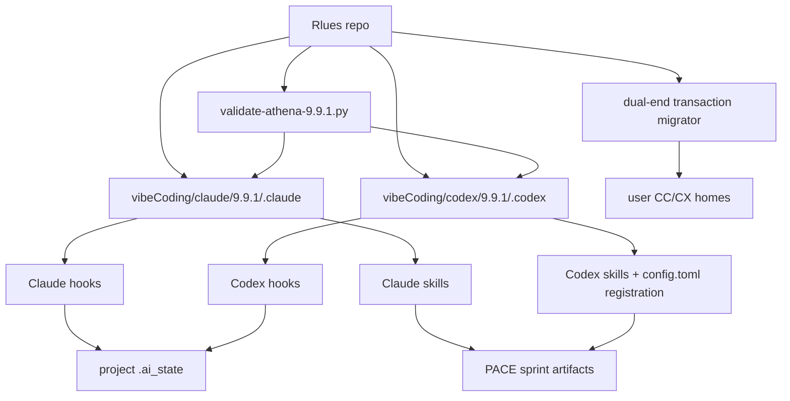
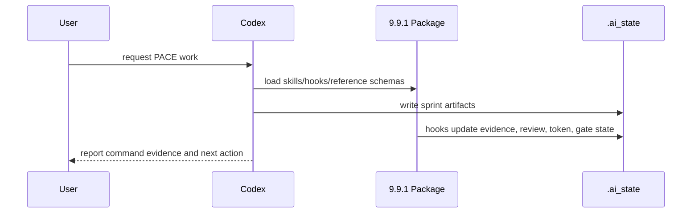

# Rlues Athena Package Architecture

## 一句话

Rlues stores immutable versioned Athena/VibeCoding distribution packages for Claude Code and Codex. `vibeCoding/{claude,codex}/9.9.1` is the current release source; 9.9.0 remains the migration baseline, and installed user-level configs are downstream artifacts.

## 组件总览

## 子系统索引

| 子系统 | 档案 | 一句话描述 |
|---|---|---|
| Athena delivery package | `lib-athena-delivery-pack.md` | 9.9.1 CC/CX package, runtime contracts, transactional setup/migrate, and release validation |

## 数据流

## 边界

- 不做: target project source generation inside Rlues itself.
- 不做: installed `~/.claude` / `~/.codex` mutation unless user explicitly asks.
- 不做: token usage estimation when hook payloads/transcripts lack usage fields.
- 不做: overwrite an existing user config or hook trust store during setup/migrate.

## 关键决策

- Token usage unknown totals use `null`, not `0` -> `compound/2026-07-08-decision-token-usage-null-and-subagent-stop.md`
- Hook/tool outcomes that cannot be proven remain `unknown`; delivery gates require explicit pass evidence -> `compound/2026-07-10-learning-codex-wire-evidence-fail-closed.md`
- Fullstack delivery orchestration remains a PACE specialization; Capability Manifest reads are runtime-only and read-only.
