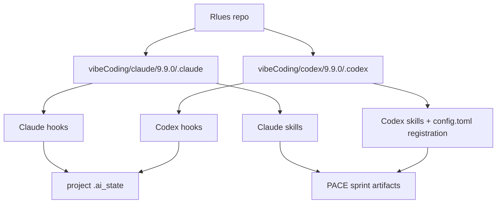

# Rlues Athena Package Architecture

## 一句话

Rlues stores versioned Athena/VibeCoding distribution packages for Claude Code and Codex. The `vibeCoding/claude/9.9.0/.claude` and `vibeCoding/codex/9.9.0/.codex` trees are source-of-truth package copies; installed user-level configs are downstream artifacts.

## 组件总览

## 子系统索引

| 子系统 | 档案 | 一句话描述 |
|---|---|---|
| Athena delivery package | `lib-athena-delivery-pack.md` | 9.9.0 fullstack-delivery skills, hooks, and shared schemas for CC/CX |

## 数据流

## 边界

- 不做: target project source generation inside Rlues itself.
- 不做: installed `~/.claude` / `~/.codex` mutation unless user explicitly asks.
- 不做: token usage estimation when hook payloads/transcripts lack usage fields.

## 关键决策

- Token usage unknown totals use `null`, not `0` -> `compound/2026-07-08-decision-token-usage-null-and-subagent-stop.md`
