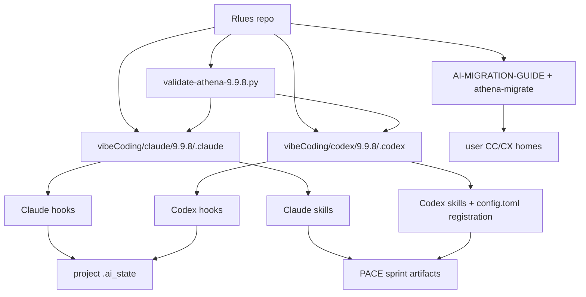
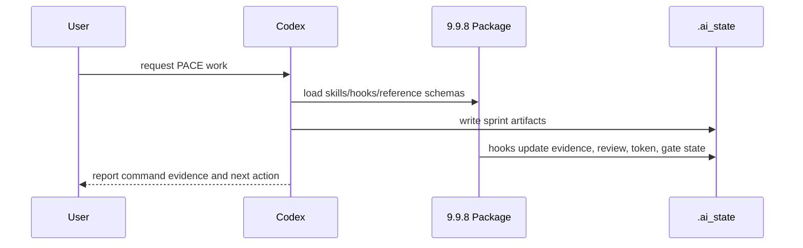

# Rlues Athena Package Architecture

## 一句话

Rlues stores immutable versioned Athena/VibeCoding distribution packages for Claude Code and Codex. `vibeCoding/{claude,codex}/9.9.8` is the current release source (see `architecture/athena-9.9.8.md`); 9.9.6-hotfix2 is the previous baseline, 9.9.3 is the compatibility floor, and installed `~/.claude` / `~/.codex` are downstream artifacts. Migration never overwrites user model/effort/output-style.

9.9.2 的发布完整性由双端 delivery-gate 机械保证：逐 AC 可采信 PASS evidence、TDD red→green、结构化用户授权、review manifest/hash、实现工作树漂移检查与 PASS-only final review。Tier2 `.ai_state` 通过 `_index` 四个权威 pointer 与有界恢复历史提供跨会话检索。

## CC 9.9.1 contract hardening (2026-07-11, Fable5 review pass1→pass3)

Codex-generated CC 9.9.1 passed a Fable5 post-implementation review that reworked four fail-open/contract defects the 143-test suite missed (fixtures had systematically avoided the triggering input shapes):

- **delivery-gate finalVerdict**: strips inline `*` before matching, so the evaluator's own `**判定**: PASS` template parses (was permanently blocking legit PASS).
- **pre-bash-guard**: structural tokenizer now recurses into `$(...)`/backtick command substitution and normalizes `rm` glob targets (`/*`, `//`, `/.`) — closing push/destructive-command bypasses; `#` comments treated inert. Known static-analysis edges (`eval $VAR`, `<(...)`) documented in RELEASE.md, defended in depth by delivery-gate + permissions.
- **PreCompact matcher**: `manual|auto` (official trigger values) — was `agent_needs_input|agent_completed`, which never fired, silently disabling snapshot fallback.
- **evidence-collector**: env-var-prefixed validation commands (`ENV=v cmd`) now recognized.

Post-§18 user decisions folded into the release: main-session `model: best` (Fable5-where-available, else latest Opus; official model-config alias), compatibility floor raised 2.1.197→**2.1.203** (all supported versions get native strong worktree isolation; manual-worktree degradation path removed), evidence schema unchanged (CC/CX gates anchor only `tool_use_id`/`result`), Agent Teams opt-in, PASS-only ship. Default Git `WorktreeCreate/Remove` hook deleted in favor of native `isolation: worktree` (`worktree-tracker.cjs` removed). Validation: 144/0 · runtime 72/0/0 (2.1.203+2.1.206 live) · migration 11/11. Implementation isolated in worktree `Rlues-cc-9.9.1-impl`; CX `delivery-gate.py` has isomorphic finalVerdict/gitLines defects handed off to the next CX patch.

## 组件总览

```mermaid
graph TD
    Repo["Rlues repo"] --> ClaudePkg["vibeCoding/claude/9.9.8/.claude"]
    Repo --> CodexPkg["vibeCoding/codex/9.9.8/.codex"]
    Repo --> Validator["validate-athena-9.9.8.py"]
    Repo --> Migration["AI-MIGRATION-GUIDE + athena-migrate"]
    ClaudePkg --> CCHooks["Claude hooks"]
    CodexPkg --> CXHooks["Codex hooks"]
    ClaudePkg --> CCSkills["Claude skills"]
    CodexPkg --> CXSkills["Codex skills + config.toml registration"]
    CCHooks --> AIState["project .ai_state"]
    CXHooks --> AIState
    CCSkills --> Sprint["PACE sprint artifacts"]
    CXSkills --> Sprint
    Validator --> ClaudePkg
    Validator --> CodexPkg
    Migration --> UserHome["user CC/CX homes"]
```

## 子系统索引

| 子系统 | 档案 | 一句话描述 |
|---|---|---|
| Athena 9.9.8 current architecture | `athena-9.9.8.md` | One native async review, design-derived packet, tree-content hash, bounded `_index`, telemetry off Git |
| Athena 9.9.6 hotfix2 architecture | `athena-9.9.6.md` | W35-W40 thin-control-plane topology, installation contract, runtime evidence and remaining AC9 risk |
| Athena 9.9.3 compatibility architecture | `athena-9.9.3.md` | Prompt/config/skill/hook topology and audited platform drift baseline |
| Athena 9.9.2 current architecture | `athena-9.9.2.md` | Dual core, four primitives, spec-gate, two-tier memory, quantum 7→2 and AI-guided migration |
| Athena delivery package history | `lib-athena-delivery-pack.md` | 9.9.1 baseline and prior transactional release mechanics |

## 数据流

```mermaid
sequenceDiagram
    participant User
    participant Codex
    participant Package as 9.9.8 Package
    participant State as .ai_state
    User->>Codex: request PACE work
    Codex->>Package: load skills/hooks/reference schemas
    Codex->>State: write sprint artifacts
    Package->>State: hooks update evidence, review, token, gate state
    Codex-->>User: report command evidence and next action
```

## 边界

- 不做: target project source generation inside Rlues itself.
- 不做: installed `~/.claude` / `~/.codex` mutation unless user explicitly asks.
- 不做: token usage estimation when hook payloads/transcripts lack usage fields.
- 不做: overwrite an existing user config or hook trust store during setup or AI-guided migration.

## 关键决策

- `_index.md` 的 route/current/history/body 溢出统一进入 Git 跟踪的 `.ai_state/index-overflow.md`；pointer 使用项目相对路径，CC/CX 共用 `_index` 锁维持 overflow-before-index 事务，不再按 sprint 分叉同名文件。
- Token usage unknown totals use `null`, not `0` -> `compound/2026-07-08-decision-token-usage-null-and-subagent-stop.md`
- Hook/tool outcomes that cannot be proven remain `unknown`; 9.9.2 additionally requires every labeled AC to have its own admissible PASS record with captured command/artifact or final review evidence -> `compound/2026-07-10-learning-codex-wire-evidence-fail-closed.md`
- 证据的 `result: pass` 只在被分类的验证命令**自身**退出状态能到达被观测到的退出码时才成立。判据三条：段的状态到达其 pipeline（末位或 `pipefail`）、该 pipeline 到达整行（其间只有 `&&`）、整行未被后台化；任一不成立则名义成功降为 `unknown` 并带 `result_reason`（`pipeline_without_pipefail` / `validation_status_not_reported` / `validation_backgrounded`），真实失败始终保持 `fail`。CC 的 Bash 响应不含 `exit_code`，因此这条边界在 CC 上尤其关键。
- 引号感知的控制符扫描位于独立的 `_shell-lex`（CC/CX/Pi 三份），**只服务证据策略**；`pre-bash-guard` 的分段器本轮字节未改。两个扫描器并存的收敛在切片 8 落定为：heredoc 白名单窄形判定单源 `_shell-lex`，guard 惰性消费、自有扫描保留为回退层；完整合并经八轮审查证伪不做（档案 sprints/2026-09-20-heredoc-aware-shell-guard/reviews/）。
- `_shell-lex` 必须由 `validationStatusPolicy` **惰性**载入：`delivery-gate` 在三端都以模块顶层无 try 的方式引入 `_input-binding`，模块层载入失败会在门禁 import 期抛错，而 CC 视 exit 1 为非阻塞、Pi 把非 2 退出码映射为放行、CX 不输出 block JSON —— 即 ship 门禁由 fail-closed 变静默放行。载入失败只降级证据。
- review 绑定 CLI 不得弄坏自己的绑定：`prepare` 把四个步骤自身会写的路径（sprint `session-log.md`、`reviews/<mode>-review.md`、`.ai_state/_index.md`）从**存储的** `input_paths` 中剔除并记入 `excluded_inputs`，因为 `liveInput` 在 bind/accept/ship 每次都重读该列表；只过滤哈希输入等于把故障推迟一步。声明为空时仍合法，只有「声明非空但排除后为空」才失败。
- 漂移诊断按证据分层：声明路径由持久化的 `input_hashes` 逐项归因（路径 + 前后哈希），聚合摘要（`source_sha256` / `environment_sha256` 等）只报轴名与两个哈希且不声称指出文件，`evidence_docs` / `evidence_ids` 指名具体文档或缺失 id。旧 row 无 `input_hashes` 时显式降级。诊断变清晰，fail-closed 不变。
- manifest 的 `implementation_commit` 在 prepare 即与 HEAD 比对，窄扫单字段：过期则失败并指出哪侧过期，缺失或非 40-hex 则跳过（完整校验仍在 ship），**绝不重写该文件**——静默改正会销毁「本次审查针对另一份代码准备」的证据。预检不新增运行期 `base_commit` 比较，ship 记账提交移动 HEAD 不作废审查这一容忍保持。
- 治理哈希由 `review-binding governance` 输出，调用门禁自己的函数而非重抄，并**按门禁的 `--git-common-dir` 规则解析 `_index.md`**：CLI 惯用的 `--show-toplevel` 在 linked worktree 中指向 worktree 根，两份 `_index.md` 会分叉，那正是该子命令要防的错哈希。
- Fullstack delivery orchestration remains a PACE specialization; Capability Manifest reads are runtime-only and read-only.
- AC 标识只从合同结构提取：design/packet 的 AC 集一律经 `acceptanceSections`（found/items 两态）取自验收小节，成对反引号 span 与围栏代码不参与 `\bAC\d+\b` 匹配（`stripInlineCode` 单实现供 design ids / packet ids / mapping labels 三消费点）。验收标题在全名三别名外增加严边界短别名 `AC`/`验收`（仅行尾或冒号后随），常量与报错文案同源（`acceptanceHeadHint` 单一来源），零小节与零条目是两条不同诊断。TDD 证据九字段合同不变，失败按「空文件 / 未解析出记录 / 第 N 条缺哪些字段 / 时间序三实际值」分层。三端消息逐字同源，Pi 由函数文本相等断言（`PiSameSourceParity`）机械钉住；切片 3 的 gate 全文件字节钉随本切片合法改 gate 而移除。
- Runtime 秘密识别按「全匹配语义」放行占位符：`SECRET` 的每个命中都过保守白名单谓词（`${…}`/`{{…}}` 引用、受限尖括号、两侧边界占位词 + ≥16 连续 alnum 否决、TBD/TODO 整值、重复字符体），任一非占位即按密钥走原路径，被释放值体复扫其余分支防吞并；应用于 runtime-run 四类 block/剔除消费点与 `_input-binding.environment()`（逐分隔符取值到行尾），`redacted()` 刻意不应用（多脱敏无害）。判不准=仍按密钥，fail-open 残余已量化（无匹配任何真实密钥格式的形状）。
