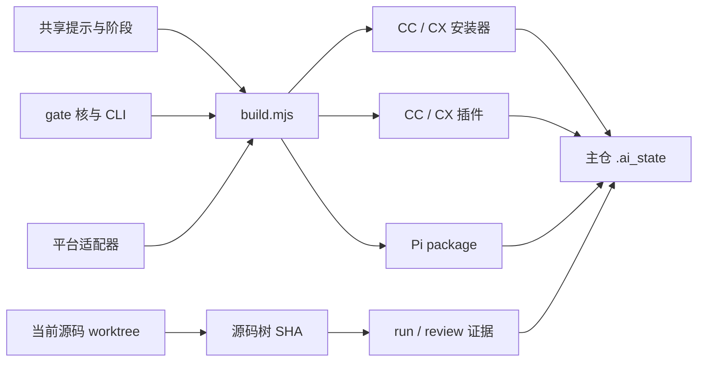

# Rlues / Athena 当前架构

Athena 源码集中在 `vibeCoding/athena/`；VERSION 为 10.1.5 候选。一个 Node.js 门禁核和 CLI、一份共享提示词，通过适配器构建 Claude Code、Codex、Pi。已安装版本独立于源码候选，以 `athena doctor` 为准。

## 组件与边界

| 组件 | 源码 | 职责 |
|---|---|---|
| 单源构建 | `build.mjs`、`VERSION`、`adapters/*/platform.json` | 合并 core、适配器、模板变量；生成 manifest 与 PACE 合同；产物目录按 major.minor（10.1），manifest 使用完整版本 |
| 门禁核 | `gate/core.cjs`、`gate/rules/`、`gate/platform/` | 三端输入归一化 → H1–H5 / 提示 → 各端阻断协议；平台只做适配 |
| CLI | `gate/cli.cjs`、`gate/cli/` | sprint、run、review、ship、writer、安装与状态查询；源码树与状态分别处理 |
| 共享提示 | `core/package/`、`core/pace/stages.yaml` | 宪法、rules、skills、阶段；构建时替换平台路径，不维护平台副本 |
| 项目状态 | 主 checkout 的 `.ai_state/` | schema athena-state/2，state version 10.1；index 路由、sprints、roadmap、issues；runtime 证据不进 Git |
| 分发形态 | `adapters/{cc,cx,pi,cc-plugin,cx-plugin,core}` | 安装器、CC/CX 插件与 Pi package 共用同一个核；插件限制见下 |
| 验证 | `evals/fixtures/` | 临时 Git 仓库覆盖三端 gate、CLI、安装/回滚与构建；真实平台探针单独记录 |

```mermaid
flowchart LR
  Core[共享提示与阶段] --> Build[build.mjs]
  Gate[gate 核与 CLI] --> Build
  Adapter[平台适配器] --> Build
  Build --> Install[CC / CX 安装器]
  Build --> Plugins[CC / CX 插件]
  Build --> Pi[Pi package]
  Install --> State[主仓 .ai_state]
  Plugins --> State
  Pi --> State
  WT[当前源码 worktree] --> SHA[源码树 SHA]
  SHA --> Evidence[run / review 证据]
  Evidence --> State
```

## 承重约束

- 当前 worktree 决定源码树哈希；主 checkout 的 `.ai_state` 是共享状态权威。状态目录及显式 review_ignore 不参与源码哈希，review 同时绑定验收行。
- H1 仅豁免登记过的 worktree 根下 `.ai_state`，源码无有效 AC 仍拦；H2/H3 在 ship 阶段要求当前树证据/审查；H4 管写者隔离；H5 管危险 shell 操作。
- `athena run` 记录命令真实执行结果。`--rebind` 按完整 argv、cwd、显式 env 区分检查；展示文本不承担执行身份，补 AC 覆盖须实际重跑；同一命令的较新失败使旧 PASS 的跳过条件失效。
- `status` 的 AC 矩阵与 ship 预检为只读；覆盖不足仍是提示。`ship` 检查 H2/H3、运行时路径引用、归档目标和 roadmap item，归档与暂存，但不 commit / push / tag。
- writer 每 sprint 一个活动窗口，只准备和接回，不启动外部模型。绑定目标 checkout/ref，自动接回仅 fast-forward；拒绝自动写入主仓状态；分叉交主 agent 整合，随后主 agent 复跑与独立审查。
- 插件自带 gate 与 templates。CC 有 bin/athena 与 agents，SessionStart 注入宪法；rules、全局设置仍属安装器。CX 插件带 skills/hooks，CLI 用 `node <插件>/gate/cli.cjs`；原生 agents/config/AGENTS 仍属安装器，hook 必须受信。两形态同端同时启用会重复执行门禁。
- Pi ≥0.87 使用 agent_before_settle 续跑；旧版 followUp。Stop 同因三次熔断是既有设计；本机 Pi 真实事件链仍待验证。
- 不把 fixture 成功等同于原生工具触发成功或行为质量评测成功；探针与发布门分别留痕。

## 文档索引

| 文档 | 用途 |
|---|---|
| `.ai_state/roadmap/athena-10-1-5/design.md` | 当前迭代边界与验收 |
| `.ai_state/roadmap/athena-10-1-5/probes.md` | 平台探针、已验证范围与剩余项 |
| `vibeCoding/athena/RELEASE.md` | 候选状态、发布门、已知限制 |
| `.ai_state/docs/reports/2026-10-04-athena-10-1-5-review.md` | 本轮审查发现与处置 |
| `athena-9.9.*.md`、`lib-athena-delivery-pack.md` | 旧架构参考；对应源码在 vibeCoding/old，不是当前实现 |
| `../decisions/2026-09-24-decision-athena-10-1-release-gate.md` | 10.1 行为评测债务 D-014 |
