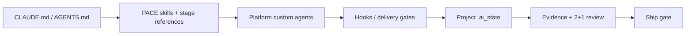

# Athena 9.9.3 current architecture

> Current-state snapshot, audited 2026-07-25 at repository commit `7d92a21`. Planned 9.9.6 changes are not part of this architecture.

## Core

9.9.3 uses `pace` as the workflow control plane and project `.ai_state` as the persistent data plane. Platform agents, skills, plugins and MCP are adapters around those two cores.

## Distribution surfaces

| Surface | Claude Code 9.9.3 | Codex 9.9.3 |
|---|---:|---:|
| Root prompt | 21 lines / 2874 bytes | 23 lines / 3468 bytes |
| Skills | 26 / 2542 SKILL.md lines | 26 / 2439 SKILL.md lines |
| Skill metadata | ~8647 bytes | ~8860 bytes |
| Custom agents | 7 markdown definitions | 9 TOML definitions |
| Hooks | 17 files / 3326 lines | 11 files / 3046 lines |
| Config | 347-line `settings.json` | 191-line `config.toml` |

The installed packages are self-contained. CC and CX skill bodies are maintained as endpoint-specific copies; only six SKILL.md files are byte-identical, while the remainder mix real platform differences with mechanical wording/path differences.

## PACE and state

- Stage model: four core stages (`plan`, `impl`, `review`, `ship`) plus five conditional stages (`brainstorm`, `roadmap`, `design`, `runtime-verify`, `polish`).
- Per-turn breadcrumb is parsed from `pace/references/stages.md`; CC/CX injection is capped at ten lines.
- Green/yellow/red ownership determines main-agent versus subagent writes and worktree isolation.
- Review uses reviewer + spec-compliance followed by evaluator; final ship requires PASS.
- Unknown tool/subagent/token evidence stays unknown or null and cannot satisfy a gate.
- The audited idle `_index.md` baseline was 165 lines / 9882 bytes; activating this roadmap keeps it near 10 KiB because it includes live route state, platform probes, preferences, pointers, workflow guidance and release history.

## Current model/config contract in the package

### Claude Code

- Main model is `best`; fallback chain is `opus` then `sonnet`.
- Agent frontmatter declares Fable/Opus/Sonnet roles, but `CLAUDE_CODE_SUBAGENT_MODEL=claude-sonnet-5` currently overrides those role selections at runtime.
- `ANTHROPIC_DEFAULT_OPUS_MODEL=claude-opus-4-8` pins the `opus` alias below the current Opus 5 release.
- `API_TIMEOUT_MS=30000` overrides the current official 600000 ms request default.
- Tool search, installation-warning suppression, attribution-header and nonessential-traffic policy are explicitly configured in the release template.
- Release compatibility still documents floor 2.1.203 and target 2.1.207.

### Codex

- Main model is `gpt-5.6-sol`, main effort high and plan effort xhigh.
- The package selects an empty `custom_openai` provider although the built-in OpenAI provider is sufficient.
- It manually sets a 1M context window and 900k compact threshold.
- It explicitly enables Stable default-on features, Experimental memories, a non-current `features.multi_agent_v2` table and legacy/undocumented agent keys.
- It manually lists all 26 skills as `enabled=true`, although current Codex auto-discovers `~/.agents/skills`.
- Machine/user settings (WSL acknowledgement and desktop UI preferences) share the release config with workflow settings.
- Release validation is pinned to exact Codex 0.144.1.

These are factual properties of the current immutable 9.9.3 package, not recommended target settings. Remediation planning is stored under `.ai_state/roadmap/athena-9-9-6-prompt-engineering/`.

## Gates and validation

- Spec/delivery gates require per-AC evidence, TDD red→green, implementation/review manifests and final PASS.
- Unresolved over-engineering findings cap evaluator output at CONCERNS.
- Canonical Codex skill path is `~/.agents/skills`; deprecated `~/.codex/skills` is fallback-only.
- Validator locks committed 9.9.2 as N-1 baseline and covers tracked/untracked drift, fresh setup and prompt-input behavior.
- Historical verified baseline: CX 67/67, CC 107/107, release validator 223/223.
- `harness-iteration-v1.1.md` is package-root documentation and is not installed as a skill.

## Boundaries

- The package does not mutate an installed user HOME without an explicit setup/migration request.
- Architecture documents describe shipped current state; unimplemented target design stays in sprint/roadmap artifacts.
- Host auto-memory is not delivery authority; project `.ai_state` remains the auditable source for route, evidence, review and ship state.
