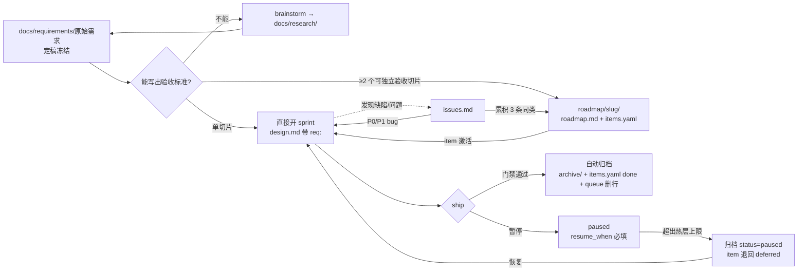

# Athena 10.1 · `.ai_state` v2：从需求到归档的完整生命周期

> 2026-09-24。取代 build-spec-final §4 的目录部分。依据：quantum-agent / Rlues 实测（见 diagnosis-10-1.md）+ 官方与社区资料（见 §8）。

## 0. 一句话

**人写的材料放 `docs/`，机器推进的状态放 `roadmap/` + `sprints/`，所有待办只进一本账 `issues.md`，做完自动归档。** `compound/` 拆掉：决策留下，教训变成规则，其余交给平台原生记忆。

## 1. 目录

```text
.ai_state/
├── _index.md                 # 路由器 ≤3 KB：path/stage/sprint/next_action/pointers
├── queue.md                  # 执行序（只排顺序和写裁定，不复述状态）
├── issues.md                 # 唯一问题账：bug / 门禁 / 上游 / 真机待验 / 顺手 / 待裁定
├── docs/                     # 人读材料，不参与门禁，按类型分
│   ├── requirements/         # 原始需求（你和 Claude 商量定稿的原文）
│   ├── research/             # 调研、勘察、对照研究
│   └── reports/              # 交付报告、验收报告、审计
├── decisions/                # ADR：一事一档（原 compound 里的 decision）
├── architecture/             # 系统现状真相（门禁有消费者，保留）
├── roadmap/<slug>/
│   ├── roadmap.md            # 拆解说明：为什么这样切、切片之间的依赖
│   └── items.yaml            # 切片清单 = 未来 sprint 清单（机器真相）
├── sprints/<slug>/           # 热层：进行中 + 暂停，合计 ≤3
│   ├── design.md             # 设计 + AC（唯一合同）
│   ├── evidence.yaml         # hook 写（合并原 tdd-evidence）
│   ├── review.json           # 原生回执 + sha（唯一审查存储）
│   └── log.md                # ≤20 行电报体
├── archive/
│   ├── YYYY-MM.tar.zst       # 已 ship sprint 按月打包入库
│   ├── issues-YYYY-MM.md     # 已结 issue 按月快照
│   └── README.md             # 旧路径 → 新路径重定向
└── .runtime/                 # gitignored：探测结果、subagent 事件、原始日志；14 天 / 50 MB
```

和现状相比删掉的：`compound/`、`proposals.md`、`vm-pending.md`、`index-overflow.md`、`harness-patches.md`（Rlues 专属，随单源构建退役）、`.snapshots/`（改进 `.runtime`）、sprint 内的 `session-log / subagent-log / subagent-events / subagent-assignments / tdd-evidence / review-packet / implementation-review / evidence/*.txt`。

## 2. `docs/` 放什么

| 子目录 | 放什么 | 规则 |
|---|---|---|
| `requirements/` | 原始需求原文，文件名 `YYYY-MM-DD-<slug>.md` | **定稿后冻结**；之后的变更只在文末追加「修订」节（日期 + 改了什么 + 谁拍板）。门禁不读它，但 roadmap 和 design 必须用 `req:` 指向它 |
| `research/` | 调研报告、竞品/官方对照、代码勘察、brainstorm 结论 | 一次调研一个目录或一个文件；被新调研推翻时在头部加「被取代 → 新档」 |
| `reports/` | 交付报告、验收报告（例如 Q12 验收）、审计、复盘 | 只写结论与证据指针，不贴原始日志（原始日志进 `.runtime/`，需要留档就打包进 archive） |

## 3. 需求 → 拆解 → sprint → 归档



### 3.1 原始需求放哪里

`docs/requirements/YYYY-MM-DD-<slug>.md`。结构固定四节：**背景与目标 · 范围与不做 · 验收（用户视角） · 待澄清问题**。你和 Claude 商量过程中的问答写进「待澄清问题」，每条带结论；全部有结论即为定稿。

### 3.2 拆解放哪里

`roadmap/<slug>/`：

- `roadmap.md`：为什么这么切、切片之间的依赖、风险。头部 `req: docs/requirements/<file>`。
- `items.yaml`：每个切片一条，就是**未来 sprint 清单**：

```yaml
- id: e1
  title: pi 钉版 + 契约探针
  status: pending        # pending | active | paused | deferred | done | dropped
  depends_on: []
  write_set: [src/engine/**, tests/engine/**]
  ac: ["AC1 ...", "AC2 ..."]   # 初始全部视为未满足（Anthropic 长任务模式：features 先标 failing）
  sprint: ""             # 激活后填 sprint slug
  deferred: {reason: "", resume_when: ""}   # 仅 deferred 时
  done: {commit: "", review: ""}            # 仅 done 时
```

单切片需求不建 roadmap，直接开 sprint。

### 3.3 怎么形成 sprint

`athena sprint start <roadmap>/<item>`（或单切片需求直接 `athena sprint start --req <file>`）：

1. 建 `sprints/YYYY-MM-DD-<path>-<slug>/design.md`，frontmatter 自动带 `req` / `roadmap` / `item` / `path`。
2. `items.yaml` 该条 `status: active`、`sprint:` 回填。
3. `_index` 切 path/stage；queue.md 不动（它只排顺序）。

**依赖波次**：`depends_on` 为空且 `write_set` 互不相交的 item 可以同时激活，按波次并行（Kiro 的 waves 做法）。CC 下每个波次可以用一个动态 workflow 跑（§6）。

### 3.4 sprint 在哪里

`sprints/` 只放热层：进行中 + 暂停，**合计 ≤3**。每个 sprint 固定 4 个入库文件（§1）。subagent 事件、原始输出一律写 `.runtime/`。

### 3.5 已完成的怎么归档

ship 门禁通过时由工具一次做完（不是提醒，是硬行为）：

1. 归档前检查：`git grep '.ai_state/'` 找代码/测试/部署对该 sprint 路径的读取，命中先改读取路径。
2. sprint 目录移到 `archive/sprints/YYYY-MM/<slug>/`；每月第一次 ship 时把上个月目录打包成 `archive/YYYY-MM.tar.zst`，展开目录不再入库。
3. `items.yaml` 标 `done` + commit + review run。
4. queue.md 删除该行；`_index` 回 idle。
5. 这些状态变更跟 ship 提交一起落，**不单独提交**。

历史档正文不改路径（改了会破坏 review sha 审计链），只维护 `archive/README.md` 重定向表。

### 3.6 延后的 sprint 怎么处置

| 情况 | 处置 |
|---|---|
| 还没开 sprint 就决定延后 | 只改 `items.yaml`：`status: deferred` + `reason` + `resume_when`（写成可判断的条件，例如"pi 接入 e2 完成后"），不建目录 |
| 已开 sprint、未派工（只有 design） | `status: paused`，留在热层；超上限时归档，item 回 `deferred` 并指向归档里的 design |
| 已开 sprint、施工到一半 | `status: paused` + log 最后一行写恢复点（分支、worktree、下一步）；超上限同上归档，代码留在分支 |
| 不做了 | `status: dropped` + 一句理由；sprint 归档，issue 关联行关闭 |

session-start 列出 `resume_when` 已满足的 deferred/paused 项，提示恢复。

### 3.7 sprint 清单在哪里

- **机器真相**：各 `roadmap/*/items.yaml` 的 status + 各 sprint 的 design frontmatter。
- **人读视图**：`athena status` 现场生成（执行序取 queue.md，状态取 items.yaml），**不落第二份文件**。
- queue.md 只写：执行顺序、每项的裁定来源、跨 roadmap 的优先级。不复述进度。

## 4. bug / 问题清单：一本账 `issues.md`

把现在的 `proposals.md`、`vm-pending.md`、queue 的「顺手池」「待裁定」、handoff 里的「本会话新坑」全部并成一张表：

```markdown
| id | 类型 | 级别 | 一句话 | 发现于 | 去向 | 状态 |
|---|---|---|---|---|---|---|
| B-031 | bug | P1 | 压缩后 stats 缺 context 键 | 2026-09-23-feature-context-visibility | sprint 2026-09-24-bugfix-context-keys | open |
| G-012 | gate | P2 | pre-bash-guard 按 heredoc 正文判推送 | quantum S14 | Rlues#queue G-012 | upstream |
| U-004 | upstream | — | SDK 不支持 skillOverrides 热更 | c0 探针 | architecture 已知限制 | closed |
| E-007 | env | — | deps-upgrade L3 待 VM 验 | 2026-09-23-quick-deps-upgrade | 下次 VM 批 | open |
| D-018 | debt | P3 | 用例名带过程编号 | review 69d9e1f6 P2 | 顺手 | open |
| Q-005 | question | — | pi ⑤ key 暴露面 | docs/research/pi-recon | 待用户裁定 | open |
```

| 类型 | 含义 | 默认去向 |
|---|---|---|
| `bug` | 产品缺陷 | P0/P1 → 立即开 Hotfix/Bugfix sprint；P2/P3 → 攒同模块 3 条开一个 Bugfix sprint |
| `gate` | 门禁/harness 误拦或缺口 | 本仓只留一行 + 指针；正文和修复在 Rlues 的 issues.md |
| `upstream` | 第三方/SDK 能力不支持 | 打标即出账：architecture「已知限制」写一句后 closed |
| `env` | 真机/VM/环境待验 | 随下一次 VM 批次处理 |
| `debt` | 小债、review P2/P3 | 下一个同写集 sprint 顺手带；超过 30 天未动升级为 bug 或 dropped |
| `question` | 需要你拍板 | session-start 置顶列出 |

规则：

- **Bugfix sprint 的 design 用三段式**：当前行为 / 期望行为 / **不变行为**（Kiro bugfix spec 的做法；"不变行为"直接变成回归测试），取代现在的 report / analyze / fix-note 三件套。
- 门禁拦截、用户纠偏、同一工具失败 3 次时，hook 自动追加一行（`gate` 或 `bug` 类型，状态 `triage`）。这是自进化闭环的入口。
- 已关闭行每月移到 `archive/issues-YYYY-MM.md`，主表只留未结项（目标 ≤40 行）。

## 5. `compound/` 怎么处理

结论：**拆掉目录，内容按作用分流**。依据：quantum 61 档里决策 35、教训 20、技巧 5、探索 1；CC 自动记忆（每会话加载 MEMORY.md 前 200 行 / 25 KB）和 Codex memories 已经原生承担「会话间回想」，官方都明确说"必须遵守的规则放 CLAUDE.md/AGENTS.md，记忆只是回想层"。

| 原类型 | 去哪 | 理由 |
|---|---|---|
| decision | `decisions/YYYY-MM-DD-<slug>.md`（ADR：背景 / 决定 / 后果 / 被取代） | 有长期引用价值，queue 和 design 在引用 |
| learning（会改变 agent 行为的） | 最近目录的 `AGENTS.md` 一行，或 `.claude/rules/` 路径作用域规则 | 必须遵守的东西要放进每次都会加载的位置；CC 2.1.277+ 读 AGENTS.md，CX/Pi 原生读 |
| learning / trick（回想即可） | 交给平台原生记忆，不入库 | 原生记忆自动整理，不占仓库 |
| trick（工具坑，例如 `cat` alias） | 对应 skill 的「已知坑」节，或门禁直接拦 | 防坑要在执行点生效 |
| explore | `docs/research/` | 本来就是调研 |

注意跨平台：CC 自动记忆存在 `~/.claude/projects/`，Codex 存在 `~/.codex/memories/`，两边不共享。所以**跨平台必须一致的教训一定要落 AGENTS.md / rules**，不能只留在某个平台的记忆里。

## 6. 超前设计点（紧贴并超过官方）

| # | 设计 | 对标 | 超出点 |
|---|---|---|---|
| X1 | **items.yaml ↔ CC 原生 Tasks 同步**（flag-gated）：激活的 item 写入 CC 任务列表，多会话用 `CLAUDE_CODE_TASK_LIST_ID` 共用 | CC Tasks：`~/.claude/tasks`，DAG 依赖，跨会话共享 | items.yaml 仍是跨平台真相，CX/Pi/Grok 读同一文件；CC 只是加速层 |
| X2 | **PACE 阶段做成 CC 动态 workflow**：`athena-review`（多维 reviewer 并行 + 对抗核验）、`athena-wave`（按依赖波次并行跑 item，每个 item 独立隔离副本） | CC dynamic workflows：脚本编排、可恢复、可存为命令、可随插件分发 | review 绑定仪式由 workflow 脚本吸收（= M10）；CX/Pi 退化为顺序执行，结果同构 |
| X3 | **需求 → AC → 测试 → 证据 → review 全链追溯**：AC id 从 requirements 一路带到 evidence 和 review.json，ship 时自动生成追溯矩阵进 `docs/reports/` | Codex 长任务四文件（Prompt/Plan/Implement/Documentation）、spec-kit、Kiro specs | 这些工具都停在 spec → tasks，没有把测试证据和审查回执绑回需求 |
| X4 | **AC 默认失败**：roadmap 建立时所有 AC 视为 failing，只有证据能翻绿 | Anthropic 长任务 harness：feature list 初始全标 failing，一次只做一个 | 翻绿由门禁机械判定，不靠 agent 自报 |
| X5 | **Grok Build 列为第四适配端**（flag） | Grok Build 官方称 AGENTS.md、skills、hooks、plugins、MCP 开箱即用 | 现在 grok 只是外部写者；成为适配端后同一份宪法和 `.ai_state` 直接可用（hooks 格式兼容度**待本机验证**） |
| X6 | **状态全部在文件里、可 diff** | Pi 的理念：不做隐藏计划和待办，状态写进文件 | 我们已经这样做；v2 把文件数从每 sprint ~15 个降到 4 个 |
| X7 | **自愈账本**：ship 自动归档/打包、issues 月结、死链扫描、热层上限、豁免过期 | 各家都没有项目状态的自动维护 | 就是 quantum 手工 tidy 的全部动作，固化成工具 |

## 7. 迁移（quantum-agent 实测对应）

| 现有 | 迁到 |
|---|---|
| `docs/2026-09-19-central-brain/` 等调研 | `docs/research/` |
| `requirements/*.md` | `docs/requirements/` |
| `docs/2026-09-23-q12-acceptance/` | `docs/reports/` |
| `compound/*decision*`（35） | `decisions/` |
| `compound/*learning*`、`*trick*`（25） | 逐条判断：行为规则 → AGENTS.md / rules；其余不迁（留在 archive 可查） |
| `proposals.md` + `vm-pending.md` + queue 顺手池/待裁定 | `issues.md` |
| `archive/sprints/`（102 个） | `archive/YYYY-MM.tar.zst` |
| `docs/archive/` 原始日志、`.snapshots/` | `.runtime/`（先 `git rm --cached`，文件保留） |
| 热层 14 个 sprint | 已 ship 的归档；暂停的（例如 C0）按 §3.6 处理 |

迁移脚本只动文件位置和索引，**历史档正文不改**；迁移前整仓打 tag，回滚就是 `git reset --hard <tag>`。

## 8. 资料来源

| 来源 | 用到的点 |
|---|---|
| [Claude Code Tasks（VentureBeat）](https://venturebeat.com/orchestration/claude-codes-tasks-update-lets-agents-work-longer-and-coordinate-across) | `~/.claude/tasks`、DAG 依赖、`CLAUDE_CODE_TASK_LIST_ID` 跨会话共享（v2.1.16，2026-01） |
| [CC dynamic workflows 文档](https://code.claude.com/docs/en/workflows) | 脚本编排、可恢复、`.claude/workflows/` 保存、插件分发、1,000 agent/run 上限 |
| [CC memory 文档](https://code.claude.com/docs/en/memory) | 自动记忆每会话加载前 200 行 / 25 KB；AGENTS.md 读取规则（2.1.277+）；`.claude/rules/` 路径作用域 |
| [Codex memories](https://learn.chatgpt.com/docs/customization/memories?surface=app) | `~/.codex/memories/`；"必须遵守的规则放 AGENTS.md，记忆只是回想层" |
| [Run long horizon tasks with Codex](https://developers.openai.com/blog/run-long-horizon-tasks-with-codex) | Prompt / Plan / Implement / Documentation 四文件；每个里程碑后跑校验（2026-02） |
| [Anthropic: Effective harnesses for long-running agents](https://anthropic.com/engineering/effective-harnesses-for-long-running-agents) | feature list 初始全标 failing；一次只做一个；进度写文件 + git |
| [Introducing Grok Build](https://x.ai/news/grok-build-cli) | plan mode、并行 subagent、AGENTS.md/skills/hooks/MCP 开箱即用（2026-05） |
| [Kiro specs](https://kiro.dev/docs/specs/) | requirements/design/tasks；bugfix spec 的当前/期望/不变行为；依赖波次并行 |
| [GitHub spec-kit](https://github.com/github/spec-kit) | constitution → specify → clarify → plan → tasks → implement → converge |
| [Pi 的上下文优先理念](https://williamjinq.com/blog/context-first-agents) | 不做内置计划/待办，状态写进文件 |

X 上的原文（Thariq「A harness for every task」、Nicolas Bustamante 的记忆对比）被 robots.txt 拦截无法直接读取；前者内容以 claude.dev 同名文章和官方 workflows 文档为准，后者未采用。
