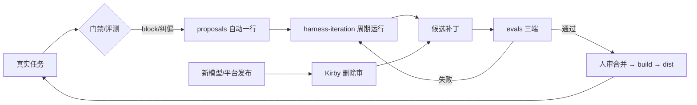

# BUILD-SPEC Athena 10.1 · FINAL（送审稿，未经 GO 不实施）

> 反驳过程见 `critique-r2.md`；真实项目数据见 `diagnosis-10-1.md`。本文件 = R3 重写 + R4 汇总。调研日 2026-09-24。

## 0. 决策摘要

R1 提 18 项 → R2 砍 4、降级 6 → 收敛 9 项 MUST；真实数据诊断后加 3 项（M10 review 一条命令、M11 冷层出主树、M12 旁路开关带过期），共 **12 项 MUST**。主线一句话：**一份源、一个门禁、一个轻状态、一套评测驱动的自进化闭环**。
命名：**10.1**（用户指定）。state schema 与发行结构都是 breaking，CHANGELOG 头注写明"用户指定 10.1，跳过 10.0"。

## 1. 方向判断：Agents → Loops → Graphs → Self-Improving

结论：**方向对，但它不是逐级爬的梯子，四层要同时存在；每层该做多厚，由失败数据决定。** Athena 现在第 2 层做过头，第 4 层没闭环。

| 层 | 行业含义 | Athena 现状 | 判断 | 10.1 动作 |
|---|---|---|---|---|
| Agents | 单 agent 执行 | CC/CX/Pi 原生 agent + 7 角色 | ✅ 够用 | 角色正文三端共用；`omitClaudeMd` 减负 |
| Loops | 容错循环 / 反馈控制 | PACE + delivery-gate + Sisyphus + continuator | ⚠️ **过重**：3 份门禁实现、启发式误拦频繁 | 门禁分硬/软两级；续跑改由"完成标准未满足"驱动（M2） |
| Graphs | 多 agent 图编排 | roadmap items + worktree 并行 + grok 外部写者 | ⚠️ 手工图，依赖靠人记 | **不做静态 DAG 引擎**；用 `items.yaml` 加 `depends_on` + `write_set`，编排仍由主 agent 按图派工 |
| Self-Improving | 系统自我进化 | proposals.md → 人审 → 补丁 | ❌ **半闭环**：只有"记录"，没有自动采集和评测把关 | 补上两段：自动采集 + 评测门禁（§3）。人只在合并处审批 |

反对意见（必须列）：
- 「图工程」对 coding agent 收益存疑：官方趋势是单个强 agent + subagent 当上下文防火墙（M5），静态多 agent 图在代码场景常见反模式是整合返工。所以 Graphs 只做**数据**（依赖 + 写集），不做**引擎**。
- 「自我进化」如果没有评测当适应度函数，就只是漂移。自动改 harness 的权限**不给**，只自动产出候选补丁 + 评测结果。

## 2. MUST 清单（验收标准可测）

| # | 项 | 验收 |
|---|---|---|
| M1 | **单源构建**：`vibeCoding/athena/{core,adapters,gate,evals}` + `build.mjs` → 生成 `dist/{claude,codex,pi}/<ver>/` | 同源重建两次字节一致；dist 文件头标「生成物勿改」；CC↔CX 共享 skill 差异只剩适配变量 |
| M2 | **单一门禁核**（JS），三端薄适配器（各 ≤150 行 payload 翻译） | 同一套 fixture 在 cc/cx/pi 三个适配器全绿；py 版 delivery-gate 从 dist 移除；9.9.9 dist 保留作回滚 |
| M3 | **门禁分级**：硬门只拦 4 条可计算事实（①非 Hotfix 无 design 不进 impl ②ship 前有测试通过证据 ③review 回执 sha 与被审文件一致 ④红区主工作树零写入）；其余转 advisory（只提示不 block） | 近期误拦样本（#13 design 新增、#15 承诺句式、跨仓 push、#14 计数）fixture 全部不再 block；4 条硬门的负例 fixture 仍 block |
| M4 | **宪法重写**：三端一份正文，≤2.5 KB（草案见 §5） | wc -c ≤2500；无 MUST/CRITICAL 大写；不复述门禁已强制的内容 |
| M5 | **`.ai_state` v2** + `migrate` 脚本 + 自动归档（§4） | Rlues 与 quantum-agent 两仓迁移后门禁全绿；`_index` ≤3 KB；热层 sprint ≤3 |
| M6 | CC 角色 `omitClaudeMd: true`（reviewer/generator/polish-worker） | 本机 CC ≥2.1.269 验证 frontmatter 生效；角色正文自带 1 行风格约束 |
| M7 | Pi 适配到 0.87：ship 硬门走 `turn_end`/`agent_before_settle`；IRON 一次性注入；peer 钉 `>=0.87 <0.88` | Pi 下 ship 缺证据时回合不结束；README 路径与实际目录一致 |
| M8 | **评测最小集**：门禁 fixture（静态，零成本）+ 3 个真实行为任务（小改/Bugfix/Feature） | `node athena/evals/run.mjs` 一条命令出三端结果表 |
| M9 | **自进化闭环 v1**（§3） | 门禁 block 与用户纠偏自动落 `proposals` 一行；每周一次 harness-iteration 产出候选补丁 + 评测结果 |
| M10 | **review 一条命令**：`athena review` 内部完成 prepare → 派发 → 绑定 → 收取；reviewer 只回 verdict + findings | quantum「门禁坑」11 条对应的 fixture 全部不再需要人工顺序；reviewer 模板里没有 run id、回执字段 |
| M11 | **冷层出主树**：已归档 sprint 按月打包 `archive/YYYY-MM.tar.zst` 入库，展开目录不入库；原始日志和 `.snapshots/` 加入 gitignore | quantum `.ai_state` git 跟踪体积 21.9 MB → ≤3 MB；包内 sha 与原文件一致（审计链不断） |
| M12 | **旁路开关带过期**：`harness_target_outside_repo` 等豁免字段改为 `{value, until, reason}` | 过期后门禁按默认执行；session-start 列出生效中的豁免 |

### 立即走 9.9.9.x patch（不等 10.1）

| # | 问题 | 依据 |
|---|---|---|
| H1 | 宪法写「CC 无原生 `/goal`」，与 CC 2.1.269/2.1.274 changelog 冲突 | [官方]；先本机 `claude --version` 验证 |
| H2 | Pi README 写 `vibeCoding/pi/plugin`，实际目录 `pi-agent/plugin` | [本地] |
| H3 | Pi peer `"*"`，0.86/0.87 连续 breaking | [源码] |
| H4 | `_index.md` 当前状态段 5 行重复死锚 `#st-0`；README 当前状态停在 9.9.8 | [本地] |
| H5 | 本机 CC 2.1.236 落后 45 版、CX 0.153.4 落后到 0.156.1 → 升级后重跑 athena-init 探测 | [源码] |

### 51 条待办提案的分流

| 类 | 去向 |
|---|---|
| 门禁误拦（#1 #13 #14 #15、跨仓 push、design_changed） | 正在拖慢日常的（#13 #15 跨仓 push）→ 9.9.9.x 只修 cjs 一份；其余并入 M2/M3 在新门禁核里一次解决，**不在 py/cjs/pi 三份上各修一遍** |
| grok-exec 简报 5 条（#4–#8） | 现在就改 skill，纯文本 patch |
| 措辞 8 条 | 并入 M4 宪法 + skill 重写 |
| 状态减脂 5 条 + 梳理 10 条 | 并入 M5 |
| 只记类 | 不动 |

## 3. PACE 完善方向

| 问题 | 改法 | 对应层 |
|---|---|---|
| stage 义务散在 stages.md/agent/模板/gate 四处，升级漏同步（9.9.9 根因） | `core/pace/stages.yaml` 只写静态事实（顺序、条件、产物、硬门），build 生成 stages.md 与 gate 合同，**不再手改 md** | Loops |
| 续跑靠 Stop hook 注入 | 续跑条件改为「design 验收标准未全勾 / queue 当前项未结」；CC 有 `/goal` 后评测等价再退役 continuator | Loops |
| 并行靠人记依赖 | `items.yaml` 加 `depends_on` + `write_set`；写集不相交才并行；公共 schema/锁文件/.ai_state 单一写者 | Graphs |
| 外部写者（grok）接回靠简报 | 接回合同固定三步：建 sprint 切 `_index` → cherry-pick → 复跑入账（提案 #8） | Graphs |
| 进化靠手记 | 自进化闭环：① hook 自动采集（门禁 block reason、用户纠偏关键词、同一工具失败 3 次）→ `proposals` 一行 ② 每周 harness-iteration 聚类成候选补丁 ③ 评测跑三端 ④ 人审合并 ⑤ 新模型发布时 Kirby 删除审 | Self-Improving |

闭环图（显示反馈回路）：



## 4. `.ai_state` v2：瘦身、归档、清理

### 目录

```text
.ai_state/
├── _index.md          # ≤3 KB，≤15 字段，只存路由+指针
├── queue.md           # 唯一现行待办（取代 handoff 追加 + 分散的 next-version 提案）
├── proposals.md       # 只留未结项 ≤30 行；已结移 archive/ledger/
├── sprints/<slug>/    # 热层 ≤3 个
│   ├── design.md      # 设计 + AC，唯一合同
│   ├── evidence.yaml  # hook 写
│   ├── review.json    # 原生回执 + sha，唯一存储；md 按需生成不入库
│   └── log.md         # ≤20 行电报体；写不下 = 该拆 sprint
├── requirements/ architecture/ compound/   # 耐久层，保留目录名减迁移成本
├── archive/{sprints/YYYY, ledger, superseded}/
└── .runtime/          # gitignored，可重建
```

### `_index.md` v2 字段

保留：`schema` `path` `stage` `sprint` `roadmap` `next_action` `route`(≤3 条) `flags{skip_polish,skip_runtime_verify,harness_target_outside_repo}` `pointers{design,review,queue}`。
移出：`platform_features` `tools_available` `cc/cx_version` → `.runtime/probe.json`（探测可重建）；`counts` `fingerprint` `last_subagent*` → `.runtime/`；`plan_critique_*` `network_in_polish` → 适配器配置；`breadcrumb` → 默认开，不存。

### 归档与清理规则

| 对象 | 触发 | 动作 | 保留 |
|---|---|---|---|
| 已 ship sprint | ship 收口时 | 移 `archive/sprints/YYYY/`；主仓整目录 `mv` + `git add -f`（带 gitignored evidence） | 热层 = 当前 + 暂停 + 上一个 ship |
| 归档前 | 每次 | `git grep '.ai_state/'` 查 src/tests/deploy 运行时读取，命中先改读取路径；比对测试 skip 数不增 | — |
| queue / proposals / vm-pending 已结项 | 清账即移 | 按批次快照进 `archive/ledger/` | 主档只留规则 + 未结项 |
| 被取代的 compound / architecture | 新决策声明取代时 | 旧档加「被取代 → 新档」行后移 `archive/superseded/` | 耐久层只留现行版（architecture 现有 4 份 superseded 可直接移） |
| `.runtime/` | session-start | 删 >14 天且非 `baseline/`；总量 >50 MB 提示 | 当前 35 MB 中 3×12 MB q12 输入包是首批候选 |
| 历史档 | 永不 | **不批量 sed**（会破坏 review sha 审计链）；只改活引用 + `archive/README.md` 重定向 | — |
| 死链 | Stop/ship 前轻扫 | pointer / 锚点存在性检查，死链点名（advisory） | — |
| 梳理提醒 | session-start | 热层 sprint >3、queue >150 行、`_index` >3 KB、同主题 compound ≥3 任一命中 → 提示开 tidy Quick | — |

### 记账降噪

- stage 转换不单独 commit，随下一实质提交或 ship 一次落（目标：`.ai_state` 独占提交占比 62% → ≤25%）。
- review 单源：只存 `review.json`（回执 + sha）；不再三处重复（receipt + 转录 md + log 标记行）。
- 诊断样本只进 roadmap notes，log 只留一行指针。

## 5. 提示词设计

### 原则（来自 M1–M7 + 本地坑）

| 原则 | 落法 |
|---|---|
| 情境化，不普适化 | "改 schema 时读 X"，不写"每次先读 A/B/C" |
| 完成标准驱动，不靠流程口号 | 宪法写清"完成 = AC 全勾 + 门禁放行"，加"别用一段说明收工" |
| 删补偿旧模型的话 | 删"认真思考""记得测试""写出推理"；思考深度交给 effort 设置 |
| 不复述门禁 | 门禁已机械强制的，宪法只写"block 时怎么做" |
| 成功静默 | 门禁/测试成功输出一行，失败才展开 |
| 无大写强调 | 去掉 MUST/CRITICAL；新模型对强调过度反应 |
| 规则带删除条件 | core 规则表加一列「补偿的失败 / 何时可删」，不进上下文 |

### 宪法草案（≈1.2 KB，三端共用，路径由 build 注入）

```markdown
# Athena — 工程协作约定
你对整合后的结果负责，不对流程数量负责。

- 状态：先读 `.ai_state/_index.md`，按 pointer 只读当前任务所需；没有就 /athena-init。
- 路由：新任务先分诊（athena-dev）。写不出验收标准 → brainstorm；≥2 个可独立验收切片 → roadmap。
- 完成：design 的验收标准全勾且门禁放行才算完成；还有未完项就继续做，不用一段说明收工。
- 写入：小改直做；单模块 Feature 派 generator；Refactor/System 或多写者用隔离工作区。
- 门禁：被 block 就按 reason 修；认为是误拦，在 proposals 记一行并请用户放行，不绕过。
- 验证：跑与改动相称的检查；成功一行，失败才展开。
- 事实：API/配置/协议引官方文档或源码；本机没验证过的标"待验证"。
- 决策：可逆的实现选择自己定；删数据、发布、付费、推送到别人仓库先确认。
- 输出：电报体，结论先行，表格优先；不复述过程，不落盘原始推理。
- 阶段义务见 {{SKILLS}}/pace/references/stages.md；平台差异见 {{ADAPTER_DOC}}。
```

### Skill 统一骨架

`SKILL.md`（≤60 行）= 何时用/不用 → 输入 → 最短步骤 → 完成条件 → 失败返回；长内容进 `references/`。description 一句、写清触发场景（GPT-6 Astra 指南）。

## 6. 源码目录（Rlues）

```text
vibeCoding/
├── athena/                     # 唯一手改源
│   ├── VERSION
│   ├── core/
│   │   ├── AGENTS.md           # 宪法正文
│   │   ├── rules.md            # 规则 + 补偿的失败 + 删除条件（不进上下文）
│   │   ├── pace/stages.yaml    # 静态事实 → 生成 stages.md + 门禁合同
│   │   ├── skills/             # 共享正文
│   │   ├── agents/             # 角色正文（无平台参数）
│   │   └── state-template/     # .ai_state v2 模板 + migrate.mjs
│   ├── gate/                   # 单一门禁核（JS）+ contracts.json
│   ├── adapters/{cc,cx,pi}/    # 原生配置、角色头、hook 薄适配、平台差异说明
│   ├── evals/{fixtures,tasks,run.mjs}
│   └── build.mjs               # 生成 dist + manifest（sha 清单，doctor 用）
├── dist/{claude,codex,pi}/10.1/   # 生成物
├── claude/ codex/ pi-agent/       # 9.9.9 及以前冻结，只读回滚源
└── scripts/                       # 旧 validate-* 逐步迁入 evals/
```

## 7. 不做的事（Out of Scope）

| 项 | 原因 |
|---|---|
| 静态多 agent DAG 引擎 | 代码场景整合返工风险 > 收益；只做依赖数据 |
| 自动合并 harness 补丁 | 无人审的自改 = 漂移 |
| 向量记忆 / 知识图谱 | 无数据 |
| 按模型分叉提示词 | 文件 ×3；用 effort 解决 |
| 三端插件化分发 | 能力边界未验证 → 只做 spike（COULD） |
| skills 28→18 | 先用 athena-metrics 统计调用频次再砍（SHOULD） |
| 时间预算信号 | 无本地数据（COULD） |

## 8. 分期与估算（估算，未验证）

| 期 | 内容 | 前置 | 估时 |
|---|---|---|---|
| 0 | H1–H5 patch；核验合入切片 5（`grok/writer-provenance`）；只修 3 条天天误拦（跨仓 push/heredoc 正文、`design_changed_after_impl`、承诺闭合句式）；切片 6、9 取消单做，并入 M2 | — | 1 d |
| α | M1 单源构建，先做到「生成物 ≈ 9.9.9」零行为变化 | 0 | 1–2 d |
| β | M2+M3 单门禁 + 分级 + fixture（最可能超时） | α | 3–5 d |
| γ | M4+M5+M6+M7+M10+M11+M12 宪法、状态 v2、review 一条命令、冷层打包、豁免过期、迁移、Pi 0.87 | β | 3–4 d |
| δ | M8+M9 评测 + 自进化闭环；在 quantum-agent 跑 ≥1 个真实 Feature | γ | 1–2 d |

## 9. 风险与回滚

| 风险 | 缓解 / 回滚 |
|---|---|
| 单门禁重写引入漏拦 | 4 条硬门负例 fixture 必须 block；9.9.9 dist 原样保留，安装器按 manifest 一键回滚 |
| 状态 v2 迁移破坏 review 审计链 | 历史档不改；migrate 只动 `_index` 与热层；迁移前整仓打 tag |
| 与在飞 sprint 冲突 | 切片 5 ship 后再开 10.1 分支；**本方案文件暂不放进 `.ai_state`**，避免成为切片 5 的未审漂移 |
| Pi API 继续抖动 | peer 钉小版本；每次升级跑 fixture |
| 删除 `.runtime` 大包不可逆 | 只做提示，删之前你确认 |
