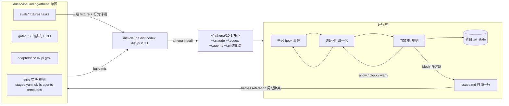

# Athena 10.1 技术设计

> 电报体。计划与切片见 `roadmap.md`；散落规划的逐条去向见 `consolidation.md`；调研与数据见 `refs/`。
> 本文是 10.1 的**唯一设计真相**；各切片 sprint 的 design.md 只写本切片的增量与 AC，引用本文章节号。

## 0. 摘要

一句话：**一份源、一个门禁核、一个轻状态、评测驱动的自进化。**

| 维度 | 9.9.9 | 10.1 |
|---|---|---|
| 源码 | `claude/`、`codex/`、`pi-agent/` 三份手工维护（skills 差异文件 51 个） | `athena/` 单源 → `dist/{claude,codex,pi}/10.1/` 生成 |
| 门禁 | CC cjs 4,844 行 + CX py 5,554 行 + Pi 分叉 3,475 行；5 个死 hook | 一个 JS 核（node）+ 三个薄适配器；硬门 5 条，其余提示 |
| review | prepare → dispatch 回执 → bind → accept → 转录；门禁坑 11 条 | `athena review prepare / accept` 两步；绑定源码树 sha |
| 证据 | 采集器猜命令形态；证据写进 sprint、worktree 回收即丢 | `athena run -- <cmd>` 直接记退出码；原始证据写主仓 `.runtime`，按源码树 sha 判有效 |
| 状态 | 每 sprint ~15 文件；46–65% 提交只记账；冷层 21.9 MB 入库 | 每 sprint 4 文件；状态随实质提交落；冷层按月打包 |
| 规划/问题 | proposals / vm-pending / 顺手池 / 待裁定 / handoff 五处 | `issues.md` 一本账 + `docs/` + `decisions/` |
| 宪法 | CC 4,049 B / CX 4,376 B，各一份 | 一份正文 ≤2.5 KB，三端生成 |
| 安装 | `setup-athena.py` + `harness-patches.md` 手工台账 | `athena install / doctor / rollback`，manifest sha 核对 |
| 评测 | validator + 221 个 fixture（py 与 cjs 各测） | 同一套 fixture 参数化跑三端适配器 + 3 个真实行为任务 |

### 需要用户拍板的决策

> **2026-09-24 已确认**：D1 降为提示；D2 + D9 采用；D7 每个 minor 3 任务 × 3 端。D3/D4/D5/D6/D8 按推荐执行，实施前无异议即视为确认。

| # | 决策 | 推荐 | 理由（数据） | 反对意见 |
|---|---|---|---|---|
| D1 | generator 链（写者溯源）从**硬门降为提示** | 降 | 门禁坑 #6/#10、P8、Q12 #1/#16、切片 5 为此写了 1,730 行；正确性由 H2 证据 + H3 独立 review 保证，谁敲的代码不改变正确性 | 失去"主 agent 不亲自写黄区代码"的机械约束 → 用 H4 管红区，黄区靠宪法 |
| D2 | CX hooks 改为 `node` 调同一个 JS 核，删除 py hooks | 改 | CC/CX 输出协议相同（`{"decision":"block"}`）；Pi 已证明"JS 核 + 薄适配"可行；py 版 2,076 行 delivery-gate 与 cjs 分叉 | CX 用户机器需有 node（本机已有；doctor 检查） |
| D3 | 拆 `compound/`；proposals / vm-pending / 顺手池 / 待裁定合并为 `issues.md` | 合 | 见 refs/ai-state-v2.md §4–5 | 迁移一次性成本；历史档不改 |
| D4 | review 绑定**源码树 sha**（排除 `.ai_state/`），不再绑 packet 输入清单 | 改 | 门禁坑 #1/#5/#8/#9、提案 C1/C2 的根因都是"输入清单漂移" | 文档类并行写入仍会让树变 → 这正是需要重审的情况 |
| D5 | 证据改为 `athena run -- <cmd>` 包装记录，采集器只做兜底 | 改 | 门禁坑 #3、Q12 #4/#10 全是"从 shell 文本推断退出码" | 需要改用法（宪法一行 + skill） |
| D6 | Grok Build 列为第四适配端（flag，先探测） | 探测后定 | 官方称 AGENTS.md/skills/hooks/MCP 开箱即用 | hooks 格式兼容度未验证 |
| D7 | 行为评测跑真实模型（花费） | 每版一次 3 任务 × 3 端 | 发布门需要"质量不退化"证据 | 有 API 花费，需你给预算 |
| D8 | 工具包装类 skill（augment / context7 / playwright / llm-as-a-verifier）先测用量再砍 | 先测 | 铁律[无数据不加/不砍] | 需在你 Mac 上跑 `athena-metrics.py` |
| D9 | 核心安装到 `~/.athena/<ver>/`，三端共用，`~/.athena/current` 软链切版本 | 采用 | 一次安装三端生效；回滚 = 切软链 | Pi 包需自带一份（vendored，同字节） |

## 1. 目标、非目标、约束

**目标**
- G1 单源生成三端发行，发行可重建、可核对。
- G2 一个门禁核；硬门只管可机器核验的事实；其余转提示。
- G3 `.ai_state` v2：需求 → 拆解 → sprint → 归档 → 延后的全生命周期由 CLI 驱动，自动维护。
- G4 提示词按 Opus 5.5 / GPT-6 官方指南重写：短、情境化、完成标准驱动。
- G5 评测把关发布；门禁拦截与用户纠偏自动进问题账，形成自进化输入。
- G6 超前接入：CC Tasks / 动态 workflow、Pi 0.87 硬停、Grok 适配端（均 flag）。

**非目标**：静态 DAG 引擎；自动合并 harness 补丁；向量记忆；按模型分叉提示词；VM 运行协议重做（9.9.9 AC9/10 延后）；全栈业务垂直切片验收（9.9.9 AC11 延后到 10.1 发布后 dogfood）。

**约束**
- 构建期 Rlues 自身仍受已安装 9.9.9(+S0 补丁) 门禁管；10.1 在 `athena-10.1` 分支构建，发布时才安装。
- 三端 `.ai_state` schema 一致；项目可在 CC/CX/Pi 之间无损切换。
- 平台能力以本机实测为准；未验证的写"待验证"，只能 flag 接入且失效不影响硬门。

## 2. 总体架构



## 3. 源码仓结构

```text
vibeCoding/
├── athena/                         # 10.1 起唯一手工编辑源
│   ├── VERSION                     # 10.1.0
│   ├── build.mjs                   # 生成 dist + manifest；确定性（排序、固定 mtime、LF）
│   ├── core/
│   │   ├── AGENTS.md               # 宪法正文（§9.1），含 {{VARS}}
│   │   ├── rules.md                # 规则 + 补偿的失败 + 删除条件（不进上下文，Kirby 审用）
│   │   ├── rules/                  # 进上下文的规则（路径作用域），≤300 行合计
│   │   ├── pace/stages.yaml        # 阶段静态事实 → 生成 stages.md 与 gate/contracts.json
│   │   ├── skills/<name>/          # 共享 skill 正文（SKILL.md ≤60 行 + references/）
│   │   ├── agents/<role>.md        # 角色正文（无平台参数）
│   │   └── templates/              # _index / design / bugfix-design / requirement / roadmap / items / issues / decision
│   ├── gate/
│   │   ├── hook.cjs                # 唯一 hook 入口：node hook.cjs <event> --platform <p>
│   │   ├── cli.cjs                 # athena CLI（§7.4）
│   │   ├── contracts.json          # 由 stages.yaml 生成：路径、阶段、硬门适用表
│   │   ├── lib/                    # context / state / tree-sha / shell-lex / frontmatter / fsx / time
│   │   ├── rules/                  # H1–H5 与 advisory 各一文件，每个 ≤300 行
│   │   └── platform/               # 事件归一化与输出渲染：cc.cjs cx.cjs pi.cjs grok.cjs
│   ├── adapters/
│   │   ├── cc/                     # settings.hooks.json、agent 头、workflows/*.js、platform.md
│   │   ├── cx/                     # hooks.json、config.toml 片段、agents/*.toml 头、platform.md
│   │   ├── pi/                     # package.json、extensions/athena.ts、platform.md
│   │   └── grok/                   # flag；探测通过前不生成发行
│   └── evals/
│       ├── fixtures/               # 由 scripts/tests/athena999 迁入，参数化 platform ∈ {cc,cx,pi}
│       ├── tasks/<t>/              # 行为任务：repo 模板 + prompt + accept.sh
│       └── run.mjs                 # 一条命令出三端结果表
├── dist/{claude,codex,pi}/10.1/    # 生成物，文件头标「生成物勿改」
├── claude/ codex/ pi-agent/        # ≤9.9.9 冻结，只读回滚源
└── scripts/                        # 旧 validate-* 迁入 evals 后删除
```

## 4. 构建与发行

| 项 | 规则 |
|---|---|
| 输入 | `athena/core`、`athena/gate`、`athena/adapters/<p>`、`VERSION` |
| 变量 | `{{PLATFORM}}` `{{SKILLS_DIR}}` `{{AGENTS_DIR}}` `{{CORE_DIR}}` `{{CONSTITUTION_NAME}}`；未定义变量 = 构建失败 |
| 映射 | 见下表 |
| 输出 | `dist/<p>/10.1/` + `manifest.json`（每文件 sha256、目标安装路径、类型：managed/config-merge/user-owned） |
| 确定性 | 同一输入构建两次字节一致（fixture 验证） |
| 头注 | 每个生成文本首行 `<!-- generated by athena build 10.1.0; edit vibeCoding/athena/... -->`（JSON/TOML 用各自注释或 `_generated` 键） |

| 源 | CC | CX | Pi |
|---|---|---|---|
| `core/AGENTS.md` | `~/.claude/CLAUDE.md` | `~/.codex/AGENTS.md` | 包内 `APPEND_SYSTEM.md` 经 extension 注入一次 |
| `core/skills/*` | `~/.claude/skills/*` | `~/.agents/skills/*` | 包内 `skills/*` |
| `core/agents/*` | `~/.claude/agents/*.md`（头：`isolation`、`omitClaudeMd`、tools） | `~/.codex/agents/*.toml` | 包内 `prompts/*.md` |
| `core/rules/*` | `~/.claude/rules/*` | 并入 AGENTS.md 引用的 `~/.codex/standards/*` | 包内 `rules/*` |
| `gate/*` | `~/.athena/10.1/` | `~/.athena/10.1/` | 包内 `core/`（vendored，同字节） |
| hooks 注册 | `settings.json` hooks → `node ~/.athena/current/hook.cjs <event> --platform cc` | `hooks.json` → `node ~/.athena/current/hook.cjs <event> --platform cx` | `extensions/athena.ts` 直接 `require` 核心 |

## 5. 门禁核

### 5.1 统一事件模型

适配器把平台 payload 转成：

```ts
type AthenaEvent = {
  platform: "cc" | "cx" | "pi" | "grok";
  event: "session_start" | "prompt" | "pre_tool" | "post_tool" | "post_tool_fail"
       | "subagent_start" | "subagent_stop" | "stop" | "compact";
  tool?: "write" | "bash" | "agent" | "mcp" | "other";
  paths?: string[];          // write 目标（绝对路径，已 realpath）；apply_patch 从补丁头解析
  command?: string;          // bash 原文
  exit_code?: number | null; // post_tool(_fail) 的真实退出码（拿不到为 null）
  agent?: { id?: string; type?: string; isolation?: string; write_set?: string[] };
  cwd: string; session_id?: string; raw_event: string;
};
```

| 平台事件 | CC | CX | Pi 0.87 |
|---|---|---|---|
| session_start | SessionStart | SessionStart | `session_start` |
| prompt | UserPromptSubmit | UserPromptSubmit | `before_agent_start` |
| pre_tool write | PreToolUse Edit/Write/MultiEdit | PreToolUse apply_patch/Edit/Write | `tool_call` edit/write |
| pre_tool bash | PreToolUse Bash | PreToolUse Bash | `tool_call` bash |
| pre_tool agent | PreToolUse Agent | PreToolUse spawn_agent/Agent | 无原生（pi-subagents 另议） |
| post_tool(_fail) | PostToolUse / PostToolUseFailure | PostToolUse | `tool_result`（待验证事件名） |
| subagent_start/stop | SubagentStart/Stop | SubagentStart/Stop | 无 |
| stop | Stop | Stop | `turn_end` / `agent_before_settle`（可返回 continue） |
| compact | PostCompact | PostCompact | `session_before_compact` |

### 5.2 输出

核心返回 `{decision: "allow" | "block" | "warn", reason, context?}`：

| 平台 | block | warn / context |
|---|---|---|
| CC | stdout `{"decision":"block","reason":...}` | SessionStart/UserPromptSubmit/PostToolUse 用 `hookSpecificOutput.additionalContext`；其余写 `.runtime/advisories.jsonl`，下一次 prompt 注入 |
| CX | 同 CC（现 py 版协议相同） | 同 CC |
| Pi | `tool_call` 返回 `{block:true, reason}`；`agent_before_settle` 返回 `{continue:true}` + 纠偏消息 | `pi.sendUserMessage` 或 advisories 注入 |

### 5.3 硬门（fail-closed）

| # | 名称 | 触发 | 判定 | 放行条件 |
|---|---|---|---|---|
| H1 | 设计先行 | pre_tool write，目标在仓库内且不在 `.ai_state/`；path ∈ {Bugfix, Quick, Feature, Refactor, System}；stage ∈ {design, impl} | 当前 sprint `design.md` 存在且至少 1 条行首 `- ACn:` 非占位验收 | Hotfix；仓库外写入；`.ai_state/` 写入 |
| H2 | 证据有效 | stop / `athena ship`，stage = ship | `.runtime/evidence/<sprint>.jsonl` 存在 `provable: true, exit: 0` 的测试类记录，且其 `tree_sha` = 当前源码树 sha | Hotfix 只需任一 provable PASS；无 sprint（idle）放行 |
| H3 | 独立审查 | 同 H2，path ∈ {Bugfix, Feature, Refactor, System} | `review.json.verdict == PASS` 且 `review.json.tree_sha` = 当前源码树 sha | 无 |
| H4 | 红区隔离 | pre_tool agent，path ∈ {Refactor, System} 或 `parallel_writers ≥ 2` | 写者型子 agent 未声明隔离（CC `isolation: worktree`；CX 待验证字段） | 子 agent 声明写面 ⊆ `.ai_state/` 或仓库外；有效豁免 `h4_worktree` |
| H5 | shell 安全 | pre_tool bash | 危险命令表（三端取并集：`rm -rf` 根/家目录、`git push --force` 到默认分支、DB 客户端连生产串、fork bomb 等）；**推送本项目仓库**且 stage ∈ {impl, review} 时拦 | 推送目标不是当前项目仓；heredoc 正文不参与判定（只看真实命令词） |

**源码树 sha**：`GIT_INDEX_FILE=<tmp> git add -A -- . ':(exclude).ai_state' && git write-tree`，在主仓计算（worktree 内调用时经 `--git-common-dir` 定位主仓，但以当前工作树内容计算）。sprint 可在 design frontmatter 声明 `review_ignore: [globs]` 追加排除。

**内部错误**：硬门规则内部异常 = block（原语义）；提示规则内部异常 = allow + warn。

### 5.4 提示级检查（warn，不拦）

| # | 检查 | 替代的 9.9.9 行为 |
|---|---|---|
| A1 | 写者溯源（generator 链 / 外部写者回执） | 硬门 → 提示（D1） |
| A2 | R/S：runtime-verify、polish（cleanup-pass）是否在 review 前完成 | 硬门 → 提示 |
| A3 | R/S：≥5 文件改动且 `architecture/` 未更新；变更集按 `design.base_commit..HEAD` 锚定（P17） | 硬门 → 提示 |
| A4 | 承诺闭合（design 写了"记 vm-pending/登台账"却无对应 issue 行），句式收窄 | 硬门 → 提示 |
| A5 | design 在 impl 后被改（仅基线已存在的 design 才算） | 标记 → 提示 |
| A6 | `_index` pointer、archive 重定向、issues 链接存在性 | 新增 |
| A7 | 热层 sprint > 3、issues 未结 > 40 行、`_index` > 3 KB、同主题 decision ≥3 | 新增（梳理提醒） |
| A8 | 豁免即将/已经过期 | 新增 |
| A9 | Bugfix：复现测试在 red 记录后被修改（flag，默认开） | 新增（explore #11） |
| A10 | reviewer 与作者同家族（`review.json.reviewer.family`）| 新增（explore #9，可设为项目硬门） |

**删除**：critic 轮次（P10）、counts（Q12 #20/#31）、light-ship 文件名判定与 `harness-patches.md` 护栏（W8）、checklist.yaml、tdd-evidence 形状校验、review-manifest / index governance、dispatch/result 回执校验、session-log 标记行。

### 5.5 豁免

```yaml
# _index.md frontmatter
exemptions:
  - key: h4_worktree            # 允许: h4_worktree | skip_runtime_verify | skip_polish | skip_architecture_check | harness_target_outside_repo
    until: "2026-09-30"         # 必填，≤14 天
    reason: "改动对象在仓库外（~/.claude）"
    by: user
```

过期即失效；session-start 列出生效中的豁免；`athena doctor` 报过期项。不存在"跳过 H2/H3"的豁免。

### 5.6 熔断

同一 session 同一 reason（归一化：去掉可变数字与路径后 sha1）连续 3 次 block → 第 3 次放行 Stop，同时向项目 `issues.md` 追加 `gate` 类 `triage` 行（自进化输入）。台账在 `.runtime/gate-ledger.jsonl`。

### 5.7 模块与规模预算

| 模块 | 预算 | 来源 |
|---|---|---|
| `lib/context.cjs`（仓库根、主仓、`.ai_state`、_index v2 解析） | ≤200 | `findAiState`、`tryRepoRoot`、`_index-io` |
| `lib/tree-sha.cjs` | ≤80 | 新 |
| `lib/shell-lex.cjs` | ≤250 | `_shell-lex.cjs` |
| `lib/frontmatter.cjs` | ≤120 | 三处复制合一（blockers P5） |
| `rules/h1…h5.cjs` | 各 ≤200 | delivery-gate / pre-bash-guard / subagent-worktree-check |
| `rules/advisory/*.cjs` | 各 ≤120 | 同上 |
| `platform/{cc,cx,pi}.cjs` | 各 ≤150 | 新（cx 含 apply_patch 路径解析） |
| `cli.cjs` + `cli/*.cjs` | 各 ≤300 | review-binding、index-updater、installer 等 |
| **合计目标** | **≤3,000 行**（现 CC 4,844 + CX 5,554 + Pi 3,475 ≈ 13,900 行） | |

### 5.8 与 9.9.9 hook 的对应

| 9.9.9 hook | 10.1 |
|---|---|
| delivery-gate | H1/H2/H3 + A1–A5 |
| pre-bash-guard + `_shell-lex` | H5 |
| subagent-worktree-check / -audit | H4 |
| evidence-collector | post_tool 兜底采集（`athena run` 为主） |
| index-updater | 删除（CLI 维护状态；counts 删） |
| design-change-detector | A5 |
| subagent-tracker | `.runtime/subagents.jsonl` 记录（A1 用），不入库 |
| session-start / compact-restore / stage-breadcrumb | session_start / compact / prompt：注入 `_index` 摘要、豁免、提示、问题置顶 |
| config-change-audit | 写 `.runtime/`（不再写 `.snapshots/`） |
| notification-router | 并入 prompt 注入 |
| stop-failure-recorder | 熔断台账 |
| `_review-binding` / `_input-binding` / `_index-bounds` | `athena review` / tree-sha / `_index` v2 有界写 |
| **死 hook**：pace-continuator ×2、compact-snapshot ×2、subagent-retry.py | 删除（未注册） |

## 6. review：两步命令

```text
athena review prepare [--scope implementation|design]
  → 计算 base_commit（design frontmatter）与当前源码树 sha；逐文件 sha 清单存 .runtime/review/<run>/files.json
  → 生成 packet：设计 AC、变更文件清单与 diff 统计、证据摘要、关注维度、transcribed_claims（design 中带「转录」标记的断言）、reviewer 输出合同
  → 输出 run id 与一句派发指令
（主 agent 派 reviewer：读 packet，按合同返回）
athena review accept --run <id|latest> [--file <path> | stdin] [--reviewer-agent <id>] [--family <anthropic|openai|xai|…>]
  → 解析：恰好一行 `VERDICT: PASS|CONCERNS|REWORK|FAIL`；发现项 `- [P0|P1|P2|P3] <file>:<line> — <text>`
  → 重算源码树 sha；不一致 → 拒绝，并列出变更文件（预期/实际 sha），提示 prepare 新 run
  → 写 sprints/<slug>/review.json，log.md 追加一行
```

`review.json`：

```json
{"schema":1,"run":"<uuid>","scope":"implementation","base_commit":"<sha>","tree_sha":"<sha>",
 "packet_sha":"<sha>","verdict":"PASS","findings":[{"sev":"P2","loc":"src/a.ts:12","text":"..."}],
 "reviewer":{"platform":"cc","agent_id":"...","family":"anthropic"},"accepted_at":"<utc iso>"}
```

reviewer 合同（写进 `agents/reviewer.md`，只此一处）：只回 `VERDICT:` 一行 + 发现项列表 + 可选总结；不写 run id、时间戳、frontmatter。

| 门禁坑（quantum） | 10.1 结果 |
|---|---|
| #1 改完 findings 后 bind 恒拒 | 无 bind；修完 prepare 新 run 即可 |
| #2 dispatch/result 回执 schema 不同 | 无回执 |
| #3 采集器只认特定命令形态 | `athena run -- <cmd>` 直接记录 |
| #5 每个 run 要全新 reviewer | 不再机械要求；A10 提示同家族 |
| #6/#10 tracker 要求新 SubagentStart、续派不入账 | 不再入门禁（D1） |
| #7 老 System sprint 别走 ship | v2 暂停/归档语义取代 |
| #8 bind 只收 UUID | `--run latest` |
| #9 result.json 三字段 | 由 CLI 生成 |
| #11 AC 行首锚定 | 保留，模板示例写明，报错列合法形态 |
| cat alias heredoc 0 字节 | 宪法/rules 一行：写文件用编辑工具或 `tee`；H5 对 `cat >` 重定向且正文为空的结果给 warn |

CC 增强（flag `cc_workflows`）：`~/.claude/workflows/athena-review.js`——阶段①agent 跑 prepare；②按维度（正确性 / 安全 / 测试 / 规格一致）并行 reviewer；③对抗核验合并；④agent 跑 accept。CX/Pi 走手动两步，结果同构。

## 7. 状态 v2

目录、生命周期、问题账、compound 分流：见 `refs/ai-state-v2.md`（本节只定 schema 与 CLI）。

### 7.1 `_index.md` v2

```yaml
schema: athena-state/2
version: "10.1"
path: Feature            # Hotfix | Bugfix | Quick | Feature | Refactor | System | ""
stage: impl              # brainstorm | roadmap | design | impl | runtime-verify | polish | review | ship | ""
sprint: 2026-09-25-feature-x
roadmap: athena-10-1
next_action: "≤160 B"
route: ["2026-09-25 Feature conf=.9 一句理由"]     # ≤3 条
parallel_writers: 1
exemptions: []                                     # §5.5
pointers: {design: "...", review: "...", queue: queue.md, issues: issues.md}
```

删除字段：`platform_features` `tools_available` `cc_version` `cx_version` `ag_callable`（→ `.runtime/probe.json`）；`counts` `fingerprint` `last_subagent*` `active_worktrees` `last_critic_round` `design_changed_after_impl` `plan_critique_*` `plan_model` `breadcrumb` `skip_*`（→ 豁免）`route_confidence`（并入 route 行）。目标 ≤3 KB。

### 7.2 sprint 文件

| 文件 | 写者 | 入库 |
|---|---|---|
| `design.md` | 主 agent / architect | 是。frontmatter：`req` `roadmap` `item` `path` `base_commit` `review_ignore?` `transcribed?`；Bugfix 用三段式（当前 / 期望 / 不变行为） |
| `evidence.yaml` | `athena ship` 由 `.runtime/evidence` 汇总 | 是（ship 时一次） |
| `review.json` | `athena review accept` | 是 |
| `log.md` | 主 agent / CLI | 是，≤20 行；超出 = 该拆 sprint（A7 提示） |

### 7.3 `items.yaml` v2

兼容 9.9.9 门禁解析（`roadmap_slug:` + `- slug:`），新增键：`depends_on` `write_set` `ac` `deferred{reason,resume_when}` `done{commit,review}`。状态：`pending | active | paused | deferred | done | dropped`（9.9.9 的 `completed` 视同 `done`）。

### 7.4 CLI

| 命令 | 作用 |
|---|---|
| `athena status [--json]` | 当前路由、热层、执行序、待裁定、生效豁免、提示 |
| `athena sprint start <roadmap>/<item>` 或 `--req <file> --path <P> --slug <s>` | 建 design（模板）、回填 item、切 `_index`、记 `base_commit` |
| `athena sprint stage <stage>` | 阶段迁移（校验顺序），不提交 |
| `athena sprint pause --resume-when "<条件>"` / `resume <slug>` / `drop --reason` | §3.6（ai-state-v2） |
| `athena run -- <cmd…>` | 执行并记录证据（exit、tree_sha、kind、截断输出 head 300 + tail 1200） |
| `athena review prepare / accept / show` | §6 |
| `athena ship` | 跑 H2/H3 + 提示；通过则汇总 evidence.yaml、归档、items `done`、queue 删行、`_index` 回 idle；`git add` 状态文件，提交由 agent 与实质改动一起做 |
| `athena issue add / close / list` | 问题账 |
| `athena tidy` | 月度打包、issues 月结、死链扫描、`.runtime` 保留期清理（14 天 / 50 MB，baseline 豁免） |
| `athena doctor` | 安装 manifest 核对、node 版本、平台探测写 `.runtime/probe.json`、过期豁免 |
| `athena migrate --to 10.1 [--dry-run]` | 项目状态迁移（§11.3） |
| `athena install --platform cc,cx,pi [--dry-run]` / `rollback` | §11 |

## 8. 证据

| 项 | 规则 |
|---|---|
| 主路径 | `athena run -- <cmd>`：真实退出码；`kind` 由命令词判定（test/typecheck/build/lint/other）；`provable = kind ∈ {test,typecheck,build}` |
| 兜底 | post_tool bash 采集器沿用 9.9.9 可证性规则（最终 pipeline + `set -o pipefail`），只在 `athena run` 未使用时生效 |
| 存放 | `<主仓>/.ai_state/.runtime/evidence/<sprint>.jsonl`（worktree 内执行也写主仓，回收不丢） |
| 有效性 | 记录的 `tree_sha` = 当前源码树 sha 才算有效（取代 9.9.9 输入绑定与"证据失效"规则） |
| 脱敏 | 命令与输出过秘密正则（三端合并，含 CX 独有规则） |
| ship 汇总 | `evidence.yaml`：每条 AC → 覆盖它的证据 id（design 中 `验证:` 行或 `athena run --covers AC2`）+ 最终 PASS 记录；未覆盖 AC 进提示（A 类），不拦 |

## 9. 提示词 v2

### 9.1 宪法（三端共用，≤2.5 KB）

```markdown
# Athena — 工程协作约定
你对整合后的结果负责，不对流程数量负责。

- 状态：先读 `.ai_state/_index.md`，按 pointer 只读当前任务所需；没有就 /athena-init。
- 路由：新任务先分诊（athena-dev）。写不出验收标准 → brainstorm；≥2 个可独立验收切片 → roadmap。用 `athena sprint start` 开 sprint。
- 完成：design 的验收标准全部有证据且门禁放行才算完成；还有未完项就继续做，不用一段说明收工。
- 写入：小改直做；单模块 Feature 派 generator；Refactor/System 或多写者用隔离工作区。
- 验证：用 `athena run -- <命令>` 跑与改动相称的检查；成功一行，失败才展开。
- 门禁：被拦就按 reason 修；认为是误拦，`athena issue add --type gate` 记一行并请用户放行，不绕过。
- 事实：API/配置/协议引官方文档或源码；本机没验证过的标「待验证」。转述别人的结论要写出处。
- 决策：可逆的实现选择自己定；删数据、发布、付费、推送到别人仓库先确认。
- 输出：电报体，结论先行，表格优先；不复述过程，不落盘原始推理。
- 阶段义务见 {{SKILLS_DIR}}/pace/references/stages.md；平台差异见 {{SKILLS_DIR}}/pace/references/platform.md。
```

删掉的 9.9.9 内容与理由：铁律 1（门禁已机械强制，不复述）；铁律 3/4/6/9 的操作细节（下沉 skill）；「INTJ 风格」；「CC 无原生 `/goal`」（与 CC 2.1.269+ 冲突）；编号铁律引用规则。

### 9.2 规则（`core/rules.md`，不进上下文）

每条：`id | 规则 | 补偿的失败（出处） | 删除条件 | 放在哪（宪法/skill/rules/门禁）`。Kirby 审逐条执行（harness-iteration v2）。进上下文的 `core/rules/*` 合计 ≤300 行（现 637 行）：doc-style 164→≤60、git-conventions 125→≤50，路径作用域能用则用。

### 9.3 skills

骨架：`SKILL.md` ≤60 行 = 何时用/不用 → 输入 → 最短步骤 → 完成条件 → 失败返回；description 一句写清触发场景；长内容进 `references/`。全部 description 合计 ≤6,500 字符（convergence explore）。

| 处置 | skills |
|---|---|
| 保留重写 | pace、athena-dev、brainstorm、roadmap、athena-review（薄：指向 CLI 与 workflow）、polish、athena-runtime-verify、athena-requirements（docs/requirements 模板 + 澄清循环）、architect-doc、biz-delivery-loop、quantum-codegen、quantum-data、deps-check（+全组件清单、依赖来源、单版本铁令）、athena-vm（+apt 源优先级、compose 镜像变量）、grok-exec（→ 外部写者合同：简报模板、402 停派、接回顺序、证据路径、署名规则） |
| 合并 | athena-preferences → athena-init；athena-migrate → athena-setup（安装器）；athena-checkpoint → athena-status；athena-issue → athena-status（问题账操作）；compound → pace/references/decisions.md（ADR 模板） |
| 删除 | antigravity（两个项目 `ag_callable: false`） |
| 先测再定（D8） | augment、context7、playwright、llm-as-a-verifier |

目标：28 → 21（D8 后可能 ≤17）。

### 9.4 agents

保留 4 个：architect、generator、polish-worker、reviewer。删除 critic、evaluator、spec-compliance（11 行 stub，"历史兼容/退役"）。CC 头统一加 `omitClaudeMd: true`（CC ≥2.1.269），角色正文自带一行风格约束；派工模板固定两句：「不带 `model:`（用户点名除外）」「commit 署名按你会话的 attribution 规则」。

### 9.5 `stages.yaml`

```yaml
paths: [Hotfix, Bugfix, Quick, Feature, Refactor, System]
stages:
  - {id: brainstorm, when: "写不出验收标准", produces: "docs/research/"}
  - {id: roadmap, when: "≥2 个可独立验收切片", produces: "roadmap/<slug>/"}
  - {id: design, paths: [Bugfix, Quick, Feature, Refactor, System], produces: "design.md", hard: [H1]}
  - {id: impl, hard: [H1, H4, H5]}
  - {id: runtime-verify, paths: [Refactor, System], advisory: [A2], exemption: skip_runtime_verify}
  - {id: polish, paths: [Refactor, System], advisory: [A2], exemption: skip_polish}
  - {id: review, paths: [Bugfix, Feature, Refactor, System], hard: [H3]}
  - {id: ship, hard: [H2, H3], advisory: [A1, A3, A4, A5, A6]}
order_note: "记账全部完成 → review prepare → reviewer → accept → ship"
```

build 从它生成 `pace/references/stages.md`（禁止手改）与 `gate/contracts.json`（P11：机器契约单一真相源）。

## 10. 平台适配

| 平台 | 要点 | 待验证 |
|---|---|---|
| CC ≥2.1.269 | hooks → `node ~/.athena/current/hook.cjs`；agents `omitClaudeMd`；`/goal` 可用 → 不再需要续跑 hook；flag：`cc_workflows`（athena-review / athena-wave）、`cc_tasks_sync`（items ↔ `~/.claude/tasks`，`CLAUDE_CODE_TASK_LIST_ID`） | tasks 磁盘格式；子 agent PreToolUse payload 是否带 agent_id |
| CX ≥0.156 | hooks.json → node；AGENTS.md；agents toml；worktree 默认开启 | spawn_agent 隔离字段名；`/goal` 本机可用性；apply_patch payload 字段 |
| Pi ≥0.87 <0.88 | `tool_call` 拦写与 bash；`agent_before_settle` 在 ship 缺证据时返回 continue（硬停）；`before_agent_start` 一次性注入宪法（0.86 起跨 resume 持久）；peer 钉版；README 路径与目录一致 | `tool_result` 事件名；`pi -p --mode json` 输出字段 |
| Grok Build（flag） | 同一 AGENTS.md + skills；hooks 若兼容 CC 格式则复用 cc 适配器 | hooks 格式、配置目录、headless 输出 |

## 11. 安装、迁移、回滚

### 11.1 安装

```text
athena install --platform cc,cx,pi [--dry-run]
  1. 检查：node ≥22、目标平台版本（probe）
  2. 备份：manifest 列出的每个目标文件 → ~/.athena/backups/<ts>/
  3. 核心：~/.athena/10.1/ ← dist 核心；~/.athena/current → 10.1
  4. 适配层：managed 文件覆盖；config-merge 文件（settings.json / config.toml / hooks.json）只改 athena 段，保留用户键
  5. 清理：9.9.9 受管但 10.1 不再有的文件（例如 py hooks、删除的 skills）移到备份目录，不直接删
  6. 写 ~/.athena/installed.json（版本、平台、manifest sha）
athena rollback → 从最近备份还原 + current 软链指回上版
athena doctor  → 逐文件 sha 对 manifest，报漂移/缺失；node 路径；过期豁免
```

`harness-patches.md` 与 `setup-athena.py` 在 10.1 退役：安装态漂移由 doctor 机械发现（解决 9.9.3 → 9.9.6 补丁被静默覆盖的根因）。

### 11.2 hook 命令里的 node

用 `/usr/bin/env node`，不写死 nvm 路径（提案 D15：卸载当前 Node 版本后门禁全失效）；doctor 检查 `command -v node` 与版本。

### 11.3 项目状态迁移 `athena migrate --to 10.1`

1. 前置：工作树干净；打 tag `pre-athena-10.1-state`。
2. `_index` v1 → v2（字段映射表写进脚本；探测类字段转 `.runtime/probe.json`）。
3. 目录：`requirements/` → `docs/requirements/`；调研类 `docs/*` → `docs/research/`；报告类 → `docs/reports/`；`compound/*decision*` → `decisions/`；其余 compound → `archive/compound/` 并产出「待转规则的教训清单」（由 agent 逐条判断，不自动转）。
4. 问题账：proposals / vm-pending / queue 顺手池与待裁定 → `issues.md` 草稿（每行带来源锚点），人工确认后替换原文件。
5. 热层：已 ship 的 sprint 归档；未完成的按 ai-state-v2 §3.6 标 paused/deferred。
6. 冷层：`archive/sprints/<YYYY-MM>*` 打包为 `archive/YYYY-MM.tar.zst`；`.snapshots/`、原始日志 `git rm --cached`（文件移入 `.runtime/`）。
7. `.gitignore` 更新；`archive/README.md` 重定向表追加。
8. 输出迁移报告到 `docs/reports/`。回滚：`git reset --hard pre-athena-10.1-state`。

## 12. 评测与自进化

| 层 | 内容 | 频率 |
|---|---|---|
| fixture | `scripts/tests/athena999` 全部迁入 `evals/fixtures`，每条参数化跑 cc/cx/pi 适配器；新增：门禁坑 11 条回归、Q12 未生效 9 条回归、构建确定性、manifest 核对、迁移 dry-run | 每次提交 |
| 行为 | 3 个任务：T1 小改（Quick）、T2 Bugfix（三段式 + 复现测试）、T3 Feature（2 个 AC）；临时 HOME 安装 dist 后用 `claude -p` / `codex exec` / `pi -p` 无头跑；记达标、回合、token、门禁拦截次数 | 每个 minor 发布；D7 预算 |
| 自进化 | 硬门 block 与熔断 → `issues.md` 自动行；`athena issue list --type gate --export` 汇总到 Rlues；harness-iteration 按「车道」处理 | 持续；可选每周发布监听 |

**10.1 发布门**：fixture 三端全绿；行为评测对 9.9.9 不退化；Rlues 与 quantum-agent 迁移 dry-run 通过且 Rlues 实迁完成；安装/回滚演练一次；quantum-agent 在 10.1 上完成 ≥1 个真实 Feature sprint（major 条件）。

## 13. 超前设计（flag）

| flag | 内容 | 默认 | 开启条件 |
|---|---|---|---|
| `cc_workflows` | athena-review / athena-wave 动态 workflow | 关 | fixture 覆盖 + 你在一次真实 review 中试用 |
| `cc_tasks_sync` | 激活 item 同步到 CC Tasks | 关 | 本机确认 tasks 文件格式 |
| `grok_adapter` | Grok Build 第四端 | 关 | 本机探测 hooks/配置/headless |
| `pi_hard_stop` | Pi `agent_before_settle` continue | 开 | Pi ≥0.87 |
| `bugfix_test_lock` | A9 复现测试保护 | 开（提示级） | — |
| `cross_family_review` | A10 升为硬门 | 关 | 项目自行开启 |

## 14. 安全与风险

| 风险 | 缓解 / 回滚 |
|---|---|
| 单门禁核漏拦 | H1–H5 各有负例 fixture；9.9.9 dist 冻结；`athena rollback` |
| D1 降级后黄区主 agent 亲写 | A1 提示 + 宪法；如数据显示问题，可把 A1 升回硬门（开关） |
| CX 机器无 node | install/doctor 前置检查，失败即停 |
| 迁移破坏审计链 | 历史档正文不改；tag 回滚 |
| Pi API 抖动 | peer 钉小版本；升级走 Platform-Bump 车道 |
| 行为评测花费 | D7 预算；只在 minor 发布跑 |
| 构建期 Rlues 自身被 9.9.9 门禁拖慢 | S0 先修误拦；必要时用带过期的豁免 |

## 15. 验收总表（10.1 发布）

| # | 验收 | 量法 |
|---|---|---|
| V1 | 单源构建确定 | 构建两次 `dist` sha 一致；CC/CX 共享 skill 只有一份源 |
| V2 | 门禁核替换三份实现 | dist 中无 py hook；fixture ≥221 条 × 3 端全绿；门禁代码 ≤3,000 行 |
| V3 | review 两步 | 门禁坑 11 条回归 fixture 全部不需要人工顺序 |
| V4 | 状态瘦身 | 每 sprint 入库 4 文件；`_index` ≤3 KB；热层 ≤3 |
| V5 | 记账提交占比 | 发布后首两周 quantum-agent 只改 `.ai_state` 的提交 ≤20%（现 46.5%） |
| V6 | 冷层 | quantum-agent `.ai_state` git 跟踪 ≤3 MB（现 21.9 MB） |
| V7 | 宪法 | ≤2,500 B；无全大写强调；三端同源 |
| V8 | 安装与回滚 | install → doctor 零漂移 → rollback → doctor 回到 9.9.9 manifest |
| V9 | 评测 | 3 任务 × 3 端不劣于 9.9.9 |
| V10 | 真实使用 | quantum-agent 在 10.1 上完成 ≥1 个 Feature sprint |
