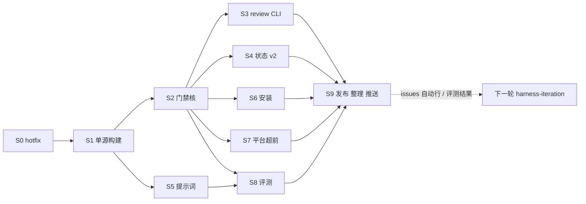

# Roadmap — Athena 10.1 迭代计划

> 设计真相：`design.md`（下文 §x 均指它）。散落规划合并表：`consolidation.md`。调研与实测：`refs/`。
> 本 roadmap 取代 `athena-9-9-9`（6 项 pending）与 `q12-batch2-production-gaps` 的剩余切片（5 已合入 main、6、9）。

## 0. 结论

10 个切片（S0–S9），6 个波次。S0 立即修 9.9.9 的误拦并安装；S1–S8 在 `athena-10.1` 分支构建；S9 发布、安装、完成 Rlues `.ai_state` 整理、清理分支、推送。估算 13–16 人日，并行后约 8–10 个工作日（估算，未验证）。

## 1. 工作方式

| 项 | 规则 |
|---|---|
| 分支 | S0 直接在 `main`；S1 起在 `athena-10.1` 分支；每个切片一个 worktree + 切片分支，review PASS 后合回 `athena-10.1` |
| 路由 | S0 = Bugfix；S1/S2/S4 = System；S3/S5/S6/S7 = Feature；S8 = Feature；S9 = System |
| 写者 | 同一波次内写集互不相交的切片可由不同写者并行（CC / CX / Grok）；公共文件（`athena/core/templates/*`、`VERSION`、本 roadmap）只由主会话写 |
| 审查 | 每切片一次独立 review；作者与 reviewer 不同家族优先（A10） |
| 门禁 | 构建期 Rlues 受已安装 9.9.9+S0 门禁管；S2 完成前不切换 |
| 证据 | 每切片 design 的 AC 必须有可复跑命令；fixture 是主要证据 |
| 状态 | 构建期仍用 v1 `.ai_state`（本 roadmap 兼容 9.9.9 门禁解析）；S9 迁到 v2 |

## 2. 切片

### S0 · gate-hotfix-9-9-9-p1（Bugfix，main，立即）

修正在拖慢日常的误拦与过期事实，装到本机，不等 10.1。

| AC | 内容 | 来源 |
|---|---|---|
| AC1 | pre-bash-guard：推送目标用 `-C <path>`/cwd 解析，只在推送**当前项目仓**时受 stage 约束；heredoc 正文不参与推送判定（CC + CX） | Q12 #29、NV-B4 |
| AC2 | design-change-detector：仅当 `git cat-file -e HEAD:<design>` 成立（基线已有 design）才置 `design_changed_after_impl`（CC + CX） | Q12 #30、NV-C13 |
| AC3 | 承诺闭合：正则收窄为承诺句式、排除紧跟 `.md` 的纯路径；`path==Quick` 且写集含 vm-pending 时跳过（CC + CX） | Q12 #27、NV-C15 |
| AC4 | 宪法删「CC 无原生 `/goal`」（CC 2.1.269+ 已有）；Pi README 路径改为 `pi-agent/plugin`；Pi peer 钉 `>=0.87 <0.88` | 调研 F1/F7 |
| AC5 | `init-platforms.py` 不再用 `'.claude' in parts` 判端（worktree 内测试幽灵失败根因） | Q12 切片 7 记账 |
| AC6 | 回归：每条一个 fixture；athena999 全量绿（需 py≥3.11 或 UTC 垫片，见 §5） | — |

写集：`vibeCoding/{claude,codex}/9.9.9/.{claude,codex}/hooks/{pre-bash-guard,design-change-detector,delivery-gate}.*`、`.../CLAUDE.md`、`pi-agent/{README.md,plugin/package.json}`、`codex/9.9.9/.codex/skills/athena-init/scripts/init-platforms.py`、`scripts/tests/athena999/test_gate_fixes_20260924.py`。
安装：用户授权后 `setup-athena.py` 同步到 `~/.claude` / `~/.codex`。估算 0.5 d。

### S1 · single-source-build（System）

| AC | 内容 |
|---|---|
| AC1 | `vibeCoding/athena/` 骨架按 §3 建立；`build.mjs` 生成 `dist/{claude,codex,pi}/10.1/` + `manifest.json` |
| AC2 | **零行为变化基线**：第一步把 9.9.9(+S0) 的 core 内容导入 `athena/`，生成物与 9.9.9 安装树逐文件对比，差异只允许是头注与平台变量替换 |
| AC3 | 同输入构建两次字节一致（fixture） |
| AC4 | 未定义模板变量 = 构建失败；生成文件首行头注 |
| AC5 | `stages.yaml` → `stages.md` + `contracts.json` 生成（§9.5，P11） |

依赖：S0。估算 1.5 d。写集：`vibeCoding/athena/{build.mjs,VERSION,core/**}`、`vibeCoding/dist/**`、`evals/fixtures/test_build.py`。

### S2 · gate-core（System，最大、最可能超时）

| AC | 内容 |
|---|---|
| AC1 | `gate/hook.cjs` 单入口 + `platform/{cc,cx,pi}.cjs` 归一化与渲染（§5.1–5.2），CX apply_patch 路径解析迁入 JS |
| AC2 | H1–H5 按 §5.3 实现；每条正例/负例 fixture |
| AC3 | A1–A10 提示级检查（§5.4），内部错误 allow+warn |
| AC4 | 豁免 `{key,until,reason}`（§5.5）与熔断→issues 自动行（§5.6） |
| AC5 | 证据：`athena run`、兜底采集器、主仓 `.runtime/evidence`、tree-sha 有效性（§8） |
| AC6 | `scripts/tests/athena999` 全部迁入 `evals/fixtures` 并参数化 cc/cx/pi；原 221 条语义保留或按 D1/D4/D5 显式改写（改写清单进 sprint design） |
| AC7 | Q12 切片 5（已合入 main 的 writer-provenance）以 A1 提示形式保留，其测试迁为提示级 fixture；切片 6（只读 Stop、架构检查基线锚定）落在 H2/H3/A3 |
| AC8 | 门禁代码 ≤3,000 行；单文件 ≤300 行 |
| AC9 | 删除 5 个死 hook；dist 中无 py hook |

依赖：S1。估算 4 d。写集：`vibeCoding/athena/gate/**`、`athena/adapters/*/hooks*`、`athena/evals/fixtures/**`。

### S3 · review-cli（Feature）

| AC | 内容 |
|---|---|
| AC1 | `athena review prepare / accept / show`（§6），`--run latest` |
| AC2 | 树变更拒绝时列出逐文件预期/实际 sha（NV-C1） |
| AC3 | reviewer 合同只在 `agents/reviewer.md`；模板无 run id / 时戳 / frontmatter（NV-C10/C11/C12） |
| AC4 | 门禁坑 11 条逐条回归 fixture（§6 表） |
| AC5 | flag `cc_workflows`：`athena-review.js` 保存到 `adapters/cc/workflows/` |

依赖：S2。估算 1 d。

### S4 · state-v2（System）

| AC | 内容 |
|---|---|
| AC1 | `_index` v2、items v2、design/review/evidence/log/issues 模板（§7，ai-state-v2） |
| AC2 | CLI：status / sprint start·stage·pause·resume·drop / ship / issue / tidy（§7.4） |
| AC3 | ship 自动归档 + 月度打包 + 归档前运行时读取检查 + gitignored 证据随迁（NV-D2/D3/D4） |
| AC4 | `athena migrate --to 10.1 --dry-run` 在 Rlues 与 quantum-agent 两仓跑通并出报告（§11.3） |
| AC5 | session-start 注入：路由摘要、生效豁免、待裁定问题置顶、恢复条件已满足的 deferred 项、梳理阈值提示 |
| AC6 | 删 counts、index-updater；`.snapshots/` → `.runtime/` |

依赖：S2（门禁读 v2 字段）。估算 2 d。

### S5 · prompts-v2（Feature）

| AC | 内容 |
|---|---|
| AC1 | 宪法 §9.1 定稿，三端生成，≤2,500 B |
| AC2 | `core/rules.md` 溯源表 + Kirby 审（对照 Opus 5.5 / GPT-6 官方指南逐条过）；进上下文规则 ≤300 行 |
| AC3 | skills 按 §9.3 处置；全部 SKILL.md ≤60 行；description 合计 ≤6,500 字符 |
| AC4 | agents 按 §9.4；CC `omitClaudeMd`；派工模板两句 |
| AC5 | consolidation.md 中标 S5 的措辞类条目全部落地（逐条勾） |

依赖：S1（与 S2 并行）。估算 1.5 d。写集：`athena/core/{AGENTS.md,rules*,skills/**,agents/**}`。

### S6 · install-doctor（Feature）

| AC | 内容 |
|---|---|
| AC1 | `athena install / rollback / doctor`（§11.1–11.2），config-merge 保留用户键 |
| AC2 | 临时 HOME 演练：9.9.9 → 10.1 → rollback → 9.9.9，doctor 两次零漂移 |
| AC3 | `harness-patches.md`、`setup-athena.py`、`athena-migrate` skill 退役（迁移说明进 RELEASE.md） |
| AC4 | `_shell-lex` 类必需资产缺失 = install 失败（Q12 切片 9 记账） |

依赖：S1、S2。估算 1 d。

### S7 · platform-ahead（Feature，flag）

| AC | 内容 |
|---|---|
| AC1 | Pi 0.87 适配：`agent_before_settle` 硬停、一次性注入、peer 钉版；Pi 0.87.1 真机冒烟 |
| AC2 | 探测报告 `docs/reports/2026-xx-platform-probe.md`：CC tasks 文件格式、子 agent payload；CX spawn_agent 隔离字段、`/goal`、apply_patch payload；Grok Build hooks/配置/headless |
| AC3 | 探测通过的项实现对应 flag（`cc_tasks_sync`、`grok_adapter`）；未通过的记 issues，flag 保持关 |
| AC4 | CC `/goal` 与 Pi continue 取代续跑 hook 的等价性说明（continuator 已是死 hook，确认无回归） |

依赖：S2。估算 1 d。

### S8 · evals（Feature）

| AC | 内容 |
|---|---|
| AC1 | `evals/run.mjs`：fixture 三端 + 构建/manifest/迁移检查一条命令 |
| AC2 | 3 个行为任务（T1 Quick、T2 Bugfix、T3 Feature）+ 临时 HOME 无头运行器（CC/CX/Pi） |
| AC3 | 对 9.9.9 跑一次基线、对 10.1 跑一次，出对比表（D7 预算内） |
| AC4 | `athena issue list --type gate --export` 汇总格式；harness-iteration v2 引用 |

依赖：S2、S5。估算 1.5 d。

### S9 · release-and-tidy（System）

| 步 | 内容 | 需你授权 |
|---|---|---|
| 1 | `athena-10.1` 全量评测绿 → 合入 `main`，打 tag `v10.1.0` | — |
| 2 | 安装到本机（cc,cx,pi），doctor 零漂移 | 是 |
| 3 | **Rlues `.ai_state` 整理**：`athena migrate --to 10.1` 实迁；旧 roadmap（9.9.1…9.9.9、q12、next-version、pi-9-10）归档；proposals / harness-patches / vm-pending → issues.md 与 archive；compound → decisions + archive；`.runtime` 大包清理；`_index` v2 | 删除 `.runtime` 大包需确认 |
| 4 | **清理分支与 worktree**：切片分支、`grok/*`、`athena-10.1`（合入后）、codex 失效 worktree 记录 | 是（删除不可逆，先列清单） |
| 5 | **推送** `main` + tag 到 origin | 是 |
| 6 | quantum-agent：`athena migrate` 实迁 + 在 10.1 上跑 1 个真实 Feature sprint（发布门 V10） | 是 |

依赖：S3–S8。估算 1 d（不含 quantum Feature 本身）。

## 3. 依赖与波次

| 波次 | 切片 | 并行写者建议 |
|---|---|---|
| W0 | S0 | CC 主会话 |
| W1 | S1 | CC 主会话（结构性，单写者） |
| W2 | S2 ∥ S5 | S2：CC generator（worktree）；S5：CX 或 Grok（worktree），写集不相交 |
| W3 | S3 ∥ S4 ∥ S6 ∥ S7 | 四个 worktree；S4 与 S3 共享 `gate/cli.cjs` 入口 → S4 先落 CLI 骨架，S3 只加 `cli/review.cjs` |
| W4 | S8 | 任一端 |
| W5 | S9 | CC 主会话 + 你授权 |

## 4. 旧规划处置（本 roadmap 生效时）

| 旧规划 | 处置 |
|---|---|
| `roadmap/athena-9-9-9`（6 项 pending，status proposed） | 标 superseded → athena-10-1；AC1–8、12–14 分入 S2/S4/S6/S7/S8；AC9/10（VM）、AC11（全栈切片）→ deferred（见 consolidation） |
| `roadmap/q12-batch2-production-gaps` 切片 5 | 代码已 cherry-pick 入 main（`08d7400..68b26f9`，221/221）；未过 review → 由 S2 review 覆盖 |
| 同上 切片 6、9 + 「归切片 9」记账 | 并入 S2 / S6（逐条见 consolidation） |
| `sprints/2026-09-06-athena-next-version/{proposals,brainstorm}.md` | 51 条提案逐条分入 S0–S9 或 dropped；brainstorm 已 superseded |
| `sprints/2026-09-13-pi-agent-9-10`（Feature，未 ship） | 被 S7 取代，S9 归档 |
| `proposals.md` P8–P17、`harness-patches.md`、`architecture/blockers-and-roadmap.md`、两篇 explore | 逐条分入或关闭；文件在 S9 迁入 issues / archive |
| quantum-agent `proposals.md` 门禁坑 + 开放行、Q12 验收未生效 9 条 | 逐条分入 S0/S2/S3/S4/S5；quantum 侧在 S9-6 迁移时改为指向 Rlues issues |

## 5. 已知环境问题

| 问题 | 处理 |
|---|---|
| Cowork 设备 VM 为 Python 3.10，`_review_binding.py` 用 `datetime.UTC`（3.11+）→ 该环境 64 条假失败 | S0 测试时用垫片或本机 py≥3.11；10.1 删除 py hooks 后消失 |
| 测试需要 git 身份 | fixture 统一设置 `GIT_AUTHOR_*` / `GIT_COMMITTER_*` 环境变量 |
| worktree 路径含 `.claude` 时安装类测试假红 8 条 | S0 AC5 修掉 |

## 6. 风险

| 风险 | 概率 | 影响 | 缓解 |
|---|---|---|---|
| S2 超时（最大切片） | 高 | 推迟发布 | 先迁 fixture 再实现；H1–H5 先行，提示级后补；可拆 S2a（核 + CC/CX）/ S2b（Pi + 提示级） |
| D1 被否 | 中 | S2 需保留写者溯源硬门（+~600 行） | 已有切片 5 代码可直接移植 |
| 行为评测不稳定 | 中 | 发布门判定困难 | 每任务跑 2 次取一致结论；预注册判据 |
| Pi 再发 breaking | 中 | S7 返工 | 钉版；Platform-Bump 车道 |
| 构建期 9.9.9 门禁拖慢自身 | 中 | 效率 | S0 先修；带过期豁免 |
