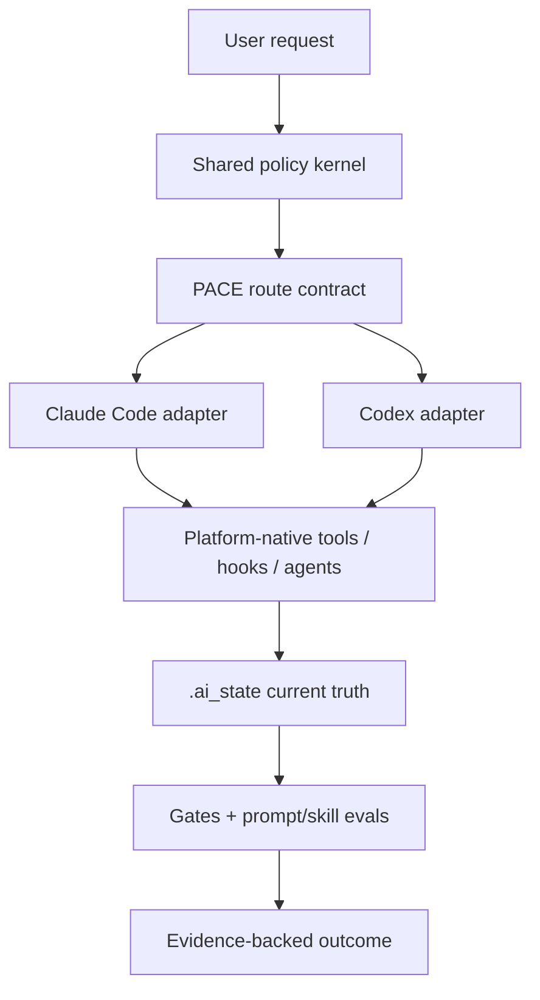

# Design — Athena 9.9.6 Prompt Engineering

> 本文是 roadmap 阶段的研究版设计，用于冻结更新方向和验收边界。它尚未通过 System path 的独立 critic gate，不授权实现。

## 背景

Athena 9.9.3 已把控制面收敛为 PACE、数据面收敛为 `.ai_state`，但平台换代后出现配置回归与上下文冗余：Claude Code 2.1.219 已发布 Opus 5，Codex 当前解析为 GPT-5.6 Sol；双端都原生提供更多默认能力，而发行包仍重复开启、硬编码或解释这些能力。

目标不是新增第三个内核，而是让现有双内核重新贴合平台真实合同，并把 prompt/skill 修改纳入可执行 eval。

## 目标

- 建立 CC/CX 共用的最小语义核，端内只保留真实机制 adapter。
- 正确接入 Opus 5 与 GPT-5.6 角色模型，消除全局 override 和旧 ID 漂移。
- 删除默认开启、过期、legacy、无 endpoint 或用户个人态配置。
- 把 skill discovery 元数据压到预算内，正文继续渐进披露。
- 不改变 PACE 的核心交付语义，减少其多处复述。
- 把 `.ai_state/_index.md` 恢复为小型当前状态索引。
- 用 prompt/skill 行为 A/B 证明删减没有降低正确性。

## 非目标

- 不实现新的 agent runtime、记忆数据库或第二状态机。
- 不把 Trellis/OpenSpec/Spec Kit/GSD 目录直接安装进项目。
- 不默认启用 Claude Agent Teams、无限嵌套 subagent 或实验性 Codex memories。
- 不为文件完全一致而伪造 CC/CX 工具、hook、worktree 与 wire 对称。
- 不在本研究 sprint 改动 9.9.3 package 或用户 HOME。
- 不静默改变用户现有 approval/sandbox/privacy/provider/UI 偏好。
- 不在没有路径使用数据时合并或重命名 PACE stages。

## 关键决策

### KD1 · 架构保持“双内核 + 双 adapter”



共享层定义“目标、权限边界、stage/role/skill 语义、完成条件”；adapter 定义“Claude/Codex 用哪个真实工具实现”。现有 package 仍是自包含安装产物。

### KD2 · 共享源只覆盖高漂移面

新增轻量 source-of-truth：

- `policy-kernel.md`：根提示词共有语义；
- `contracts/stages.yaml`：stage 名、入口、出口和强制 artifacts；
- `contracts/roles.yaml`：角色职责、读写能力、模型档位；
- `contracts/skills.yaml`：skill 名、trigger-only description、隐式调用策略；
- 两个小 adapter：平台称谓、worktree/subagent/hook 机制。

生成器只渲染根 prompt、catalog metadata 和易漂移 reference；不把全部 26 个 SKILL.md 正文改造成模板语言。双端正文继续维护真实平台差异，validator 依据 contracts 做语义 parity。

### KD3 · 根 prompt 变成六项 policy kernel

根 `CLAUDE.md` / `AGENTS.md` 只保留：

1. 结果责任与沟通风格；
2. PACE 分诊先于写入；
3. 绿/黄/红区所有权与授权边界；
4. `.ai_state` 当前真相与恢复入口；
5. evidence / gate / done 条件；
6. 反过度工程与平台机制诚实不对称。

TDD、每个 stage 的完整义务、review schema、工具说明、模型默认、host memory 等移到已有 canonical skill/reference/frontmatter，不在根 prompt 重复。

### KD4 · 平台默认采用“省略即配置”

发行模板只写三类值：

- Athena 明确选择且不同于平台默认；
- 安全/权限边界，需要用户看见；
- 安装或 gate 运行所必需。

平台默认开启的 feature、模型元数据、自动发现路径、机器 NUX 和 UI 偏好全部省略。用户已有同名设置由迁移 preserve，不因 release 模板省略而删除。

### KD5 · 模型在角色边界选择

Claude：main=`best`; architect/critic/evaluator 候选 `opus+xhigh`; implementation/review 候选 `sonnet+high`。删除 `CLAUDE_CODE_SUBAGENT_MODEL` 与一方 API model pins。

Codex：main/high-value=`gpt-5.6-sol`; 常规实现/读取候选 `gpt-5.6-terra`。保留 plan `xhigh`，main high 与 medium 做 A/B。agent 明确 model 时仍需有“不支持则继承 main”的迁移/验证策略，不静默换到未知模型。

### KD6 · skill catalog 是索引，不是微型 SKILL.md

- description 只回答“何时用、处理什么、不处理什么”。
- 双端 catalog metadata 总量目标 ≤ 6500 chars。
- setup/migrate/init/preferences/status/checkpoint/vm 等维护类或副作用 skill 默认只显式调用。
- skills 数暂维持 26；合并/删除只在调用方和行为 eval 证明后进行。
- `pace` 是路由全景，`athena-dev` 是入口；二者不重复整张 stage 表。

### KD7 · PACE 先收敛出处，不改状态机

9.9.6 保留 4 core + 5 conditional stage。`stages` contract 是唯一 transition truth：

- breadcrumb 从 contract 派生；
- root prompt 只指向 route；
- agent prompt 只描述本角色的输入/输出；
- gate 只做机械可判定检查；
- skills 处理需要判断的流程。

是否在后续版本压缩 stage，必须先有 9.9.6 的路径使用与误路由数据。

### KD8 · `.ai_state` 分成稳定索引与易变探测

`_index.md` 目标 ≤ 4 KiB，只含：

- path/stage/current sprint/roadmap；
- route confidence + 最近 3 条 route 摘要；
- pointers；
- gate preferences / next action / active worktrees；
- counts；
- 最近 ≤10 条 current-state 摘要。

移出：

- 完整工具调度教程（回到 PACE references）；
- 平台 feature/tool 逐项 probe；
- release diary；
- 空 stage hook history；
- 已由 JSONL 记录且长期陈旧的 last-subagent 字段。

新增 `runtime-capabilities.yaml`，由 init/status 刷新并包含 `detected_at`、host versions 和可用能力。它是易变观测，不是交付完成证据；`_index` 只保留 pointer 或简短健康状态。

### KD9 · prompt/skill 用 TDD 式 eval

每个高影响删改先执行 9.9.3 baseline，再执行 9.9.6：

1. 模糊需求只问一个最高价值问题；
2. 已清晰 Quick 不过度路由；
3. Feature 正确委派；
4. System 创建 worktree、绑定 agent、验证边界；
5. 缺 evidence / review 时 gate 阻断；
6. 状态/解释请求不产生外部写入；
7. 用户中途补充/覆盖请求正确处理；
8. compaction 后从小索引恢复；
9. skill 显式/隐式触发正确；
10. 角色模型与 effort 实际解析符合矩阵。

正确性是硬门槛；效率指标包括 prompt bytes/tokens、无必要澄清次数、skill 误触发、tool calls、wall time 和模型成本。不能用“字更少”替代交付正确性。

## 目标配置轮廓

### Claude Code base

保留：schema、`model=best`、fallback alias、worktree baseRef、Athena version、permissions、必要 hooks/plugins。

删除：全局 xhigh、所有一方 model pins、全局 subagent model、tool-search default、30s API timeout、installation warning suppression、gateway-only attribution tuning、release-owned privacy preference。

可选配置（不进通用默认）：gateway model pins、strict network allowlist、privacy/telemetry、workflow size、Agent Teams。

### Codex base

保留：`gpt-5.6-sol`、main/plan effort、`web_search=live`（Athena 当前证据策略）、显式权限/沙箱政策、正式 agent concurrency、Athena version、必要 plugins/hooks。

删除：空 custom provider、manual context metadata、stable feature flags、experimental memories、`multi_agent_v2` 表、legacy/undocumented agent fields、26 个 skill enabled entries、机器/UI settings、unstable-warning suppression。

`approval_policy=never` + `danger-full-access` 是独立高权限产品决策，roadmap 确认不等于授权更改；实现前单独确认。

## 验收标准

### 平台合同

- [ ] AC1: CC floor ≥2.1.219；`opus` 在 exact floor 上解析到 Opus 5，且 agent role model 不被 env override。
- [ ] AC2: CC config 不含旧 dated model pin、30s API timeout、默认 tool-search 开关或 installation-warning suppression。
- [ ] AC3: CX floor ≥0.144.4；使用 built-in OpenAI provider；无空 custom provider、1M/900k manual metadata。
- [ ] AC4: CX config 只使用当前正式字段；default-on features、experimental memories、manual skill registration 与个人 UI/NUX 项为零。

### Prompt / skills / PACE

- [ ] AC5: 双端根 prompt 由同一 policy kernel 渲染/校验，平台 adapter 差异有 allowlist。
- [ ] AC6: stage/role/skill contracts 有唯一来源，validator 能发现双写漂移。
- [ ] AC7: 双端 skill catalog 完整发现 26 skills，metadata ≤6500 chars；维护类 skill 不隐式调用。
- [ ] AC8: 4 core + 5 conditional transitions、green/yellow/red ownership、2+1 review 与 fail-closed gates 语义不变。

### `.ai_state`

- [ ] AC9: fresh `_index.md` ≤4 KiB，当前恢复、route、pointers、preferences、next action 和 worktree 信息完整。
- [ ] AC10: capability snapshot 有 version + `detected_at`；stale probe 不被当成当前平台事实。
- [ ] AC11: 9.9.3 fixture 可无损迁移；未知 evidence 仍为 unknown/null；历史 sprint 不重写。

### 验证与交付

- [ ] AC12: prompt A/B 场景全过，正确性与 gate compliance 不低于 9.9.3 baseline。
- [ ] AC13: 至少一个效率指标改善；若无改善，回退对应删减而不是宣称成功。
- [ ] AC14: 双端 syntax/runtime/fresh install/migrate/exact-version/validator 全绿，无未经用户批准的 skip。
- [ ] AC15: System path 正式 design 完成至少两轮独立 critic，review 2+1 PASS，runtime-verify 与 polish PASS。
- [ ] AC16: 9.9.6 architecture、release notes、migration guide 和 compound learning 与实现一致。

## File Structure Plan（目标态，正式 plan 可收窄）

```text
vibeCoding/
├── shared/9.9.6/
│   ├── policy-kernel.md
│   ├── contracts/
│   │   ├── stages.yaml
│   │   ├── roles.yaml
│   │   └── skills.yaml
│   └── adapters/
│       ├── claude.md
│       └── codex.md
├── claude/9.9.6/
│   ├── .claude/{CLAUDE.md,settings.json,agents/,skills/,hooks/}
│   ├── AI-MIGRATION-GUIDE.md
│   └── RELEASE.md
├── codex/9.9.6/
│   ├── .codex/{AGENTS.md,config.toml,agents/,skills/,hooks/}
│   ├── AI-MIGRATION-GUIDE.md
│   └── RELEASE.md
└── scripts/
    ├── render-athena-9.9.6.py
    ├── validate-athena-9.9.6.py
    ├── test-athena-claude-9.9.6-runtime.cjs
    ├── test-athena-9.9.6-runtime.py
    └── evals/athena-9.9.6/
        ├── scenarios.yaml
        └── assertions.yaml

.ai_state/
├── _index.md
├── runtime-capabilities.yaml
└── architecture/
    └── athena-9.9.6.md                # ship 时才创建 current-state 档
```

## 风险与权衡

- 共享合同会新增 build-time 概念，但它已有两个真实消费者；范围限制在高漂移元数据，避免模板系统吞掉全部 skills。
- `_index` 4 KiB 是目标预算，不是为了满足数字而丢状态；若 consumer proof 需要更大，必须记录具体字段和理由。
- Terra/Sonnet 角色降本只有 eval 通过才落地；模型档位不是审美选择。
- 省略 default 配置减少漂移，但升级时平台默认可能变化；exact-version validator 与 release-time source refresh 是补偿机制。
- 维护 skill 禁止隐式调用会降低“自动帮忙”，但显著收窄 setup/migrate 等副作用面。

## 历史决策对齐

- 不恢复 quantum 旧 7 skills；9.9.6 只优化 catalog。
- 重新审计 `_index` 不否定 9.9.2 当时的“无孤儿”结论；删除前先迁移 consumer，并以 fixture 证明。
- token/evidence unknown 语义保持不变。
- canonical install path 与 worktree ledger 必须由 runtime 测试证明，不接受仅静态 path grep。

## Independent review status

PENDING。按 Codex binding handshake 启动的只读 architect 没有产生可绑定的 raw Start event；主线程已停止该 agent，且确认它没有读写或联网。依据 fail-closed 编排规则，本研究 sprint 不伪造独立评审结果。roadmap 获确认后，item 2 必须先恢复 binding evidence，再完成 System path 的正式多轮 critique。

## 来源

完整 source map 与逐项配置依据见：

- `../../roadmap/athena-9-9-6-prompt-engineering/drafts/research.md`
- `../../roadmap/athena-9-9-6-prompt-engineering/drafts/current-state-audit.md`
