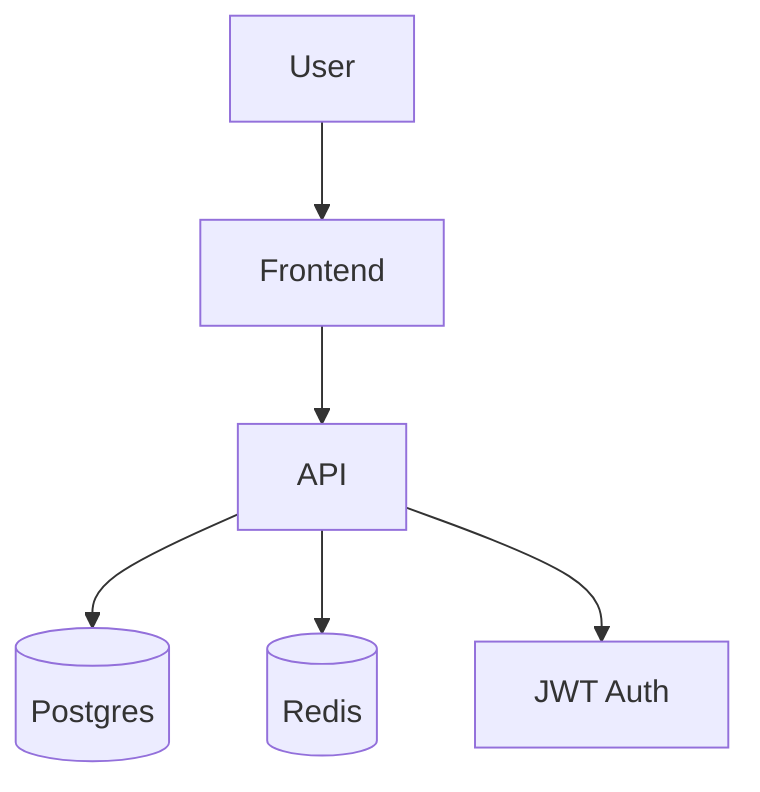
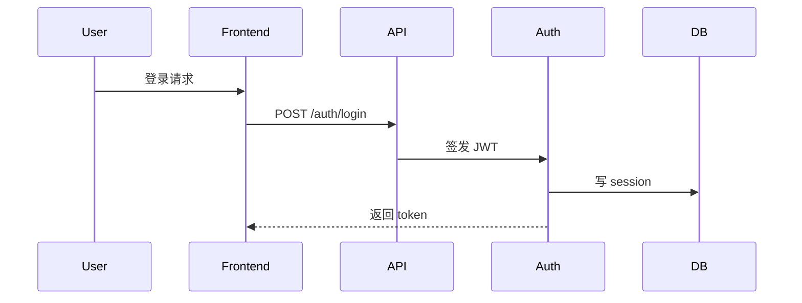

# {Project Name} Architecture

> 项目**现状档**, 反映当前系统形态. 不写演进历史 (看 git log + compound/decision-*.md).
> 由 architect-doc skill 维护. Refactor/System ship 前强制更新.

## 一句话

[项目核心定位, 不超过 1 段]

## 组件总览

## 子系统索引

| 子系统 | 档案 | 一句话描述 |
|---|---|---|
| API | `api-rest.md` | REST API + OpenAPI |
| DB | `db-postgres.md` | Postgres 主库 + 读副本 |
| Auth | `auth-jwt.md` | JWT (RS256) + refresh token |

(按实际项目填写)

## 数据流 (主要业务路径)

[mermaid sequence diagram 描述关键业务流]

## 边界 (本项目**不**做的事)

[明确写出来, 防止 scope creep]

- 不做: OAuth 第三方登录 (用户独立账号体系)
- 不做: 实时推送 (轮询为主)
- 不做: 多租户 (单租户)

## 关键决策 (引用 compound/decision-*.md)

[列出 architecture 受影响的历史决策]

- JWT 用 RS256 → `compound/2026-05-25-decision-jwt-rs256-vs-hs256.md`
- DB 选 Postgres → `compound/2026-04-12-decision-postgres-vs-mongo.md`
