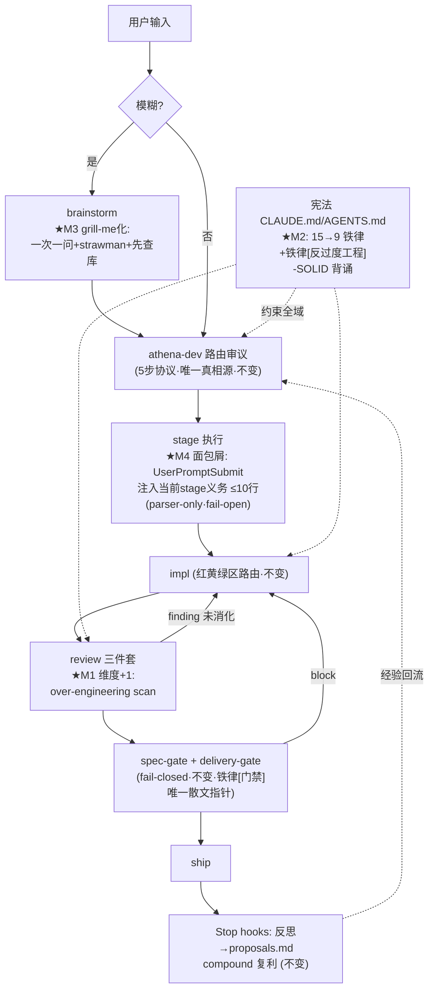

# BUILD-SPEC v9.9.3 · FINAL — "Anti-Overengineering & Lighter Loop"

日期: 2026-07-14 · 基线: 9.9.2 · 版本号: **9.9.3 用户拍板** (内容含 minor 级项, 沿 9.9.2 "用户拍板沿用" 先例) · 流程: harness-iteration 压缩版 (四轮合一文档, 反驳痕迹内嵌; 去保守化系用户显式指令)

---

## 0. 决策摘要

围绕两根主线收敛: **(a) 新增核心律法「反过度工程」并全链路布线; (b) 按 9.9.2 复盘结论给热路径减重** (grill-me 化 brainstorm / 宪法收敛 / stage 面包屑)。
R1 候选 9 项 → R2 砍 3 项、降级 3 项 → 收敛 **5 MUST + 1 配套修订**。
超前设计依据: CC 2.1.206 `/doctor` 官方新增 "trim CLAUDE.md" 检查 `[官方]` — 宪法瘦身已是官方认可方向, 不是激进实验。

---

## 1. S0 思辨表 (压缩)

| 需求 | 元问题 | 判定 |
|---|---|---|
| 加「禁止过度设计/过度防御」铁律 | 已有 KISS/YAGNI 散文覆盖吗? — 覆盖名义存在但无执行维度: reviewer/critic 无此检查项, dogfood 可见 agent 生成投机抽象与吞错降级 | **MUST** (加且布线, 光加散文=白加) |
| 15 铁律再+1 → 16 条? | 宪法已超重 (9.9.2 复盘结论), 净增反向 | **加一折七**: 新铁律换掉门禁已覆盖的散文, 净 -6 |
| grill-me 化 brainstorm | 现 brainstorm 是"生成提案→用户审阅"重模型, 用户认知负荷高 | **MUST** (低风险, 单 skill 改写) |
| pace 面包屑 (Trellis) | 触 hook 协议, 但 fail-open 可控; 直接治"pace 必读"每 sprint 税 | **MUST** (flag 默认开, fail-open) |
| JSONL 上下文清单 / stage 4+opt-in | 结构级路由语义变化, 需路由 dogfood 数据支撑 | **降级 → 9.10.0** |

---

## 2. MUST 清单

### M1 · 铁律[反过度工程] — 新核心律法 + 全链路布线

**宪法条文草案** (电报体, CC/CX 双端同文):

> **反过度工程** — 禁止过度设计与过度防御性编程:
> 无第二消费者不抽象; 无现实需求不加配置项/参数/扩展点; 不为想象的未来写代码。
> 防御只设在信任边界 (用户输入/外部 IO/跨进程/权限面); 边界内信任类型与不变量 — fail-fast, 禁吞异常、禁静默降级、禁 blanket try-catch、禁逐行 null 偏执。
> 判据: 删掉该抽象/分支/参数后测试仍全绿且无真实调用方 = 过度, 删。
> 边界声明: harness 门禁与防御纵深 (delivery-gate/spec-gate/mtime 兜底) **不属此列** — 它们防的是 agent 失败模式, 有 dogfood 数据支撑; 本律法约束**产出代码**与**新增 harness 机制**。

**布线** (复用现有 CHECKER, 不新增 hook/gate — 新增执法机器本身就违反本律法, 自反一致):

| 文件 | 改动 |
|---|---|
| `.claude/CLAUDE.md` (+CX `AGENTS.md`) | 新铁律入宪 (见 M2 合并重写) |
| `agents/critic.md` | plan/design 批判维度 +1: 挑战投机抽象/配置项/"以后可能用" |
| `agents/reviewer.md` | review 维度 +1: over-engineering scan — spec 外的抽象/参数/防御分支 → 列 finding |
| `agents/evaluator.md` | VERDICT 判据 +1: over-engineering finding 未消化 → 上限 CONCERNS |
| `rules/coding-standards.md` | 具体反模式清单: 吞异常 / 空 catch / 默默 fallback / 单实现接口 / 未消费配置项 / 边界内重复校验 |
| `skills/polish/SKILL.md` | cleanup-pass 检查项 +1: 删死防御与死抽象 |

### M2 · 宪法收敛 15 → 9 (含新铁律)

原则: **门禁能查的散文全部折叠为指针; 模型推不出的项目机械全留。** 官方背书 `[官方 CC 2.1.206 /doctor]`。

新 9 条草案:

| # | 铁律 | 来源 |
|---|---|---|
| 1 | **门禁即律法** — 设计先行/TDD red→green/tasks 全绿/Review 三件套/runtime-verify/polish/architecture 更新, 由 spec-gate (impl-entry+ship) 与 delivery-gate fail-closed 强制; 散文不复述, 违者 block | 折叠原 1/2/3/4/10/14 |
| 2 | **零写入·按区路由** — 红黄绿区 + 红区 `isolation: worktree` 强制 | 原 11 保留 |
| 3 | **分诊先行** — 审议路由 + route-note 落盘 + re-route 只升不降 | 原 13 保留 |
| 4 | **文档即真相·索引先行** — .ai_state 单一真相源, 入口 `_index.md`, 决策前读索引禁全扫 | 原 5+8 合并 |
| 5 | **证据与出处** — 报完成附可复核命令输出/diff; API/配置/协议必引官方 URL | 原 6+7 合并 |
| 6 | **复利颗粒化** — compound/ 一事一档 ≤100 行 | 原 12 保留 |
| 7 | **反过度工程** — (M1 条文) | **新增** |
| 8 | **Hook 是进化器** — Stop 反思写 proposals.md | 原 9 保留 |
| 9 | **四原语** — Workflow 统领 / SubAgent 执行 / Skill 赋能 / MCP 连接; 引用用 `铁律[名称]` | 原 15 保留 |

**同时删**: 尾行 SOLID 逐字母背诵 (`SRP·OCP·LSP·ISP·DIP·DRY·KISS`) — OCP/ISP 背诵直接诱导投机接口与预留扩展点, 与铁律[反过度工程]正面冲突; 保留 `第一性原理·先WHY后HOW`。
**预期**: 宪法实质行 29 → ≤22, tokens 814 → ~600 (o200k, 实施后实测)。
**引用面同步**: 全仓 `铁律[名称]` 引用 grep 核对, 折叠项引用改指 `铁律[门禁]`; CC/CX 双端 parity。

### M3 · brainstorm 前端 grill-me 化

改写 `skills/brainstorm/SKILL.md` 交互模型, 借 mattpocock/satya-janghu grill-me `[社区]`:

- **一次一问** + 每问附 strawman 推荐答 (用户做选择题, 不审作文)
- **investigate-don't-ask**: 答案在 repo/.ai_state/architecture 里就自己读 (接 augment/context7), 不烦用户
- **隐式 lens**: 第一性/pre-mortem/边界测试/五 whys 混用不报菜名
- **押后收敛**: "感觉够了再问三个"; 禁"我总结一下"式提前收口
- 产物不变: `sprints/{slug}/brainstorm.md` (对应 grill-me 的 .grill log); 路由闸门与"写不出验收标准=模糊→brainstorm"判定不变
- 附带: `pace/templates/sprints/brainstorm.md` 模板改 distilled-log 格式 (Intent / Constraints / Key decisions / Surfaced assumptions / Open questions / Out of scope, 空段删除) — 存结论与理由, 不存问答过程

### M4 · pace 面包屑 (per-turn workflow-state, 借 Trellis)

治"pace SKILL 每 sprint 必读"固定税:

- 新 hook `stage-breadcrumb.cjs` 挂 `UserPromptSubmit`: 读 `_index.md` (stage/path/next_action) → 从 `references/stages.md` 取当前 stage 义务块 → additionalContext 注入 ≤10 行面包屑
- **parser-only, 无文案副本** (真相仍在 stages.md, 对齐 9.9.2 反双写纪律); 解析失败注入空 = **fail-open**, 不 block 不误导
- pace/SKILL.md 头注降级: "必读" → "面包屑失效或需全景时 Read"
- flag: `_index.breadcrumb` 默认 `on`, 可关
- ⚠️ hook 用 exec form 语义自查 (CC 2.1.207 shell-injection 修复背景 `[官方]`; 本包 hook 均为纯 `node` 命令无 `${user_config.*}`, 零改动确认即可)

### M5 · harness-iteration v1.1 包根分发文档修订

用户指令: 不过度保守, 紧跟版本甚至超前。修订上传版 v1.0:

| 条款 | v1.0 | v1.1 |
|---|---|---|
| Dogfood | 一律 ≥2 周 | 分级: patch 冒烟即可 / minor ≥1 真实项目 / major ≥2 周 |
| 四轮迭代 | 一律四文件 | 规模分级: ≤5 文件改动 → 单文档内嵌反驳痕迹; 结构变化才走完整四轮。反驳痕迹非空仍是硬规则 |
| 超前设计 | 无条款 (实质禁止) | **新增**: 官方已 announce/beta 功能允许 flag-gated + fail-open 接入, 不等 GA; 铁律4 不臆造不变 — 未验证 API 不编码, flag 默认关 |
| R3 ≤ R1×70% | 机械比例 | 改为"每项 R1 提案必挂 ≥1 反驳", 缩水比例仅作参考不作门禁 |
| 白名单 `WenJunDuan/Rlues` | ⚠ fetch 失败待校验 | 改指本地 workspace `~/workspace/Rlues` (仓库在本地, 无需 fetch) |

保留不动: S0 思辨 / S2 权威源 fetch 协议 (失败即停不编造) / S5 用户确认门 / 反模式表。

---

## 3. Out of Scope (R2 砍/降级 + 理由, 审计用)

| 项 | 处置 | 反驳理由 |
|---|---|---|
| 为反过度工程新增 delivery-gate 检查 | **砍** | 自反矛盾: 加执法机器治过度工程=过度工程; reviewer/critic/evaluator 现有 CHECKER 足够, 无数据前不上机械门禁 |
| SOLID 尾行保留 | **砍** | 与新铁律冲突 (OCP/ISP 诱导投机接口); Fable/Opus 级模型不需要背诵设计原则 |
| 四轮流程整体搬进 PACE | **砍** | harness 迭代 SOP ≠ 业务开发流程, 混入即过度流程化 (v1.0 skill 自己的 Out of Scope 也这么写) |
| JSONL per-task 上下文清单 | **降 9.10.0** | 动 plan 模板 + subagent 注入协议, 结构级; 与 stage 压缩同批做 |
| stage 4 核心+opt-in 压缩 | **降 9.10.0** | 改路由语义 = minor 级结构变化; 需 9.9.3 面包屑跑出的路径使用数据支撑 |
| CX 端独立增补 | **降级为翻译任务** | 本次全部改动为 prompt/skill 层, 按 CC→CX 映射表平移; CX changelog 涉及端内引用时实施前核对, 不臆造 |

**自我反对 (必列)**: 宪法折叠后, prompt 层"事前预防"语义变弱、只剩门禁"事后拦截"?
反驳: spec-gate 已是 impl-entry + ship 双层 (9.9.2 落地), 检查本就前移; M4 面包屑每轮注入当前 stage 义务, 恰好补足"事前提醒"且比 15 条常驻散文便宜。残余风险见 §6。

---

## 4. 量化范围表

| 维度 | 9.9.2 | 9.9.3 目标 | Δ |
|---|---|---|---|
| 宪法实质行 (CC) | 29 | ≤22 | -7, 铁律 15→9 |
| CLAUDE.md tokens (o200k) | 814 | ~600 (实测为准) | ≈ -26% |
| skills 数 | 26 | 26 | 0 (brainstorm 原地改写) |
| hooks 数 | 16 | 17 | +1 (stage-breadcrumb, fail-open) |
| agents 数 | 7 | 7 | 0 (3 个原地加维度) |
| 每 sprint 固定加载 | pace 85 行必读 | 面包屑 ≤10 行/轮 | 热路径税大降 |
| 新增门禁 | — | 0 | 反过度工程自反一致 |
| .ai_state schema | 9.9.2 审计版 | +1 字段 (`_index.breadcrumb`) + brainstorm 模板格式 | **不动结构** — 9.9.2 字段审计无孤儿、门禁全挂其上, 动 schema 回归成本>收益; 结构演进 (per-task JSONL 清单落 `sprints/{slug}/`) 排 9.10.0 |

---

## 5. 架构图 (双内核不变, 增改点标注)

反馈回路: review→impl (finding 回炉) / gate→impl (block 回炉) / Stop→路由 (proposals 经验回流)。

---

## 6. 风险与回滚

| 风险 | 等级 | 对策/回滚 |
|---|---|---|
| 铁律[反过度工程]被 agent 滥用为"少写测试/少防边界"的借口 | 中 | 条文显式写"信任边界防御必须有"+"harness 门禁不属此列"; reviewer 双向 scan (过度防御与防御缺失都列 finding) |
| 宪法折叠后弱模型 (sonnet subagent) 行为漂移 | 中 | 折叠项全部有 fail-closed 门禁兜底; 观察一个 sprint, 漂移则把对应义务写进 agent frontmatter 而非回填宪法 |
| 面包屑 hook 注错 stage 误导主 agent | 中 | fail-open (解析失败=不注入) + delivery-gate 不受其影响仍兜底; flag 可一键关 |
| 引用面漏改 (`铁律[TDD]` 等散引) | 低 | 实施时全仓 grep `铁律[`, 折叠项引用改 `铁律[门禁]`; harness 校验脚本加引用一致性检查 |
| 版本号 9.9.3 与"结构变化递增 minor"纪律冲突 | 已消化 | 用户拍板, CHANGELOG 头注声明 (9.9.2 同款先例) |

回滚: 单 commit 实施, `git revert` 一步回 9.9.2; 面包屑另有 flag 软回滚。

---

## 7. 实施顺序与验收

| 步 | 内容 | 验收 |
|---|---|---|
| 1 | M2 宪法重写 (CC+CX) | 实质行 ≤22; `铁律[` 全仓引用 0 悬空; token 实测记录 CHANGELOG |
| 2 | M1 布线 (critic/reviewer/evaluator/coding-standards/polish) | 冒烟: 投喂故意过度防御样例 diff → reviewer 产出 over-engineering finding, evaluator 给 CONCERNS |
| 3 | M3 brainstorm 改写 | 冒烟: 模糊需求输入 → 一次一问+strawman, 不吐整版提案; 收敛后 brainstorm.md 落盘 |
| 4 | M4 面包屑 hook + pace 头注降级 | `node --check`; 冒烟: 正常注入 ≤10 行 / _index 缺失时零注入零报错; flag off 生效 |
| 5 | M5 harness-iteration v1.1 | 双端包根分发 `harness-iteration-v1.1.md`; 明确不安装为 skill, skill 数仍为 26 |
| 6 | 回归 + 发布 | fork `validate-athena-9.9.3`; 双端 runtime 全绿; CHANGELOG/RELEASE 更新 |

工时: M2 1.5h / M1 2h / M3 1h / M4 2h / M5 1h / 回归 2h ≈ **9.5h**。最可能超时: M4 (hook 冒烟矩阵)。

---

## 8. 来源

- `[官方]` CC changelog 2.1.186–2.1.207 (含 2.1.206 /doctor trim-CLAUDE.md、2.1.207 hook exec-form、2.1.202 skill 重复加载修复): https://code.claude.com/docs/en/changelog
- `[社区]` grill-me SKILL 原文: https://raw.githubusercontent.com/satya-janghu/agent-skills/main/skills/grill-me/SKILL.md (Matt Pocock 谱系, MIT)
- `[社区]` Trellis 架构 (workflow-state 面包屑/parser-only/scoped context): https://docs.trytrellis.app/advanced/architecture
- `[本地]` 9.9.2 全量复盘 (2026-07-14 会话): 热路径量化 + 规训→门禁结论
- `[白名单:本地]` `~/workspace/Rlues/vibeCoding/claude/9.9.2/` 源码与 CHANGELOG

---

**S5 用户确认门**: 本 SPEC 为 R4 FINAL。回复 `GO` 进实施 / `MODIFY <改动>` 回炉 / `WAIT` 挂起。
