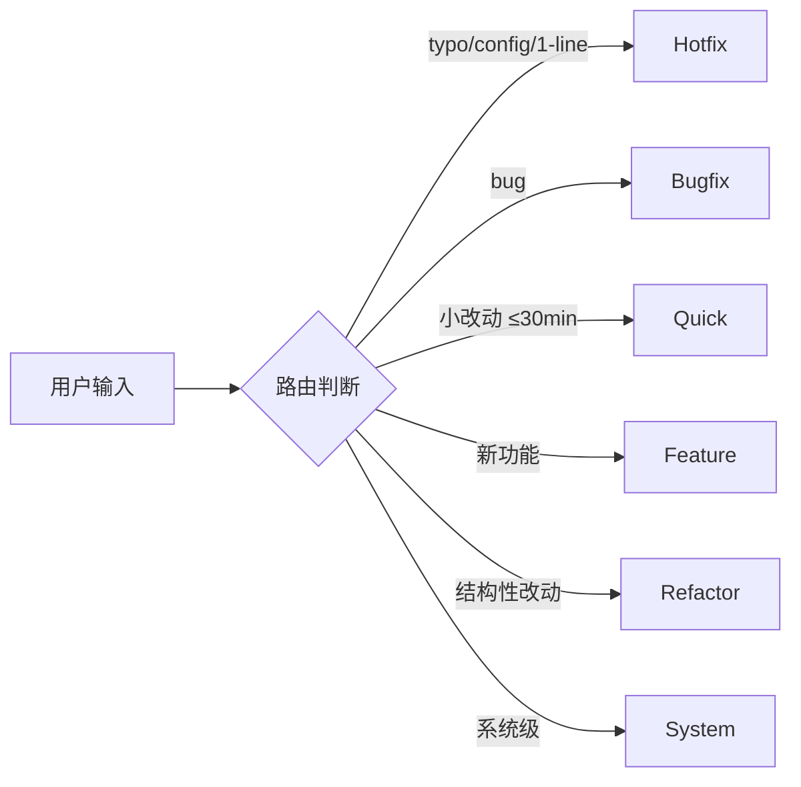
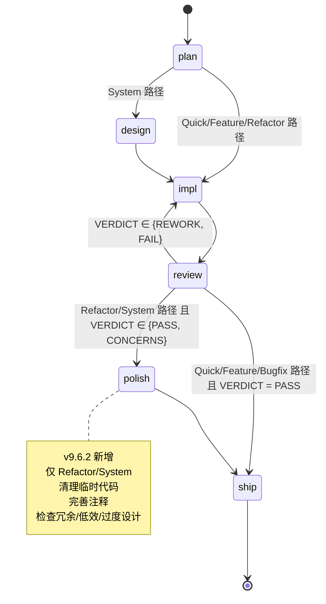

# /pace — Athena PACE Orchestration (v9.6.2)

## 概念

PACE = **P**ath + **A**genda + **C**onstraint + **E**xit. 一句话: **按路径分流, 状态机推进, 规范注入, 退出可验证**.

## 6 路径 (按复杂度递增)



| 路径 | 触发 | 适用场景 | polish? |
|---|---|---|---|
| **Hotfix** | typo, config, 1-line | 紧急小修, 不进入 review | 否 |
| **Bugfix** | bug 复现 + 修 | 单点修复, TDD 强制 | 否 |
| **Quick** | ≤ 30 分钟改动 | 小功能 / 小重构 | 否 |
| **Feature** | 新增功能 | 完整 design.md + 测试 | 否 |
| **Refactor** | 结构性改动 | 不改功能, 改实现 | **是** |
| **System** | 跨模块 / 数据层改动 | 全套流程 | **是** |

## 6 stage (状态机)



| stage | 进入条件 | 主要操作 | 退出条件 |
|---|---|---|---|
| plan | 任何路径起点 (Hotfix 跳过) | 写 design.md 需求段 | design.md 需求段完成 |
| design | 仅 System 路径 | 架构提案 (架构师视角) | design.md 架构段确认 |
| impl | plan/design 完成 | TDD 实施 | 所有 Task GREEN |
| review | impl 完成 | review_pass1: findings + VERDICT | VERDICT = PASS/CONCERNS |
| **polish** | Refactor/System + review VERDICT ∈ {PASS, CONCERNS} | 5 检查项 + cleanup-pass.md | cleanup-pass.md 完成 |
| ship | polish 完成 / 其他路径 review PASS | git commit + push | commit msg 符合 git-conventions |

## stage × path 矩阵 (哪个 stage 在哪个路径)

| stage | Hotfix | Bugfix | Quick | Feature | Refactor | System |
|---|---|---|---|---|---|---|
| plan | ❌ | ✓ | ✓ | ✓ | ✓ | ✓ |
| design | ❌ | ❌ | ❌ | ❌ | ❌ | **✓** |
| impl | ✓ | ✓ | ✓ | ✓ | ✓ | ✓ |
| review | ❌ | ✓ | ✓ | ✓ | ✓ | ✓ |
| **polish** | ❌ | ❌ | ❌ | ❌ | **✓** | **✓** |
| ship | ✓ | ✓ | ✓ | ✓ | ✓ | ✓ |

## stage × subagent 矩阵 (CC 端)

| stage | subagent 调度 (CC) |
|---|---|
| plan | 主 agent 或 Task `subagent_type: generator` (做调研) |
| design | 主 agent |
| impl | Task `subagent_type: generator` (TDD 实施) |
| review | Task `subagent_type: reviewer` + Task `subagent_type: evaluator` |
| polish | spawn_agent `polish_worker.toml` (Refactor/System 专用) |
| ship | 主 agent |

## CX 端 stage × subagent 矩阵 (官方文档源)

| stage | spawn_agent 调用 |
|---|---|
| plan | 内置 `explorer` 或 spawn_agent `docs_researcher.toml` |
| design (System) | spawn_agent `architect.toml` |
| impl | 内置 `worker` 或 spawn_agent `generator.toml` |
| review | spawn_agent `reviewer.toml` + `pr_explorer.toml` + `evaluator.toml` |
| polish | spawn_agent `polish_worker.toml` (Refactor/System 专用) |
| ship | 主 agent |

源:
- https://developers.openai.com/codex/subagents (spawn_agent / spawn_agents_on_csv)
- https://developers.openai.com/codex/cli/slash-commands (内置 explorer / worker / default)

## stage × rules 注入矩阵

| stage | 注入的 rules |
|---|---|
| plan | (none) |
| design | coding-standards, ui-guidelines |
| impl | coding-standards, ui-guidelines, security-checklist |
| review | **全部 5 个** (coding/ui/doc/git/security) |
| polish | doc-style, coding-standards |
| ship | git-conventions |

注入方式: stage 切换时, 主 agent 显式 `Read ~/.claude/rules/<file>.md` 后进入下一步.

## stage × 工具矩阵 (v9.6.2 新, 关键补丁)

每个 stage 进入时, 主 agent **首先读 `.ai_state/_index.md.tools_available`**, 然后按下表选工具.
注意: 工具的可用性由 athena-init 探测填入 `_index.md`, 不要假设.

| stage | 工具优先级 | skill 引用 |
|---|---|---|
| **plan** (调研) | 1. `context7` (npx ctx7) <br> 2. `augment` MCP (语义检索) <br> 3. WebSearch + WebFetch <br> 4. (option) `antigravity` (agy -p) 外包大型调研 | `~/.agents/skills/_athena/context7/SKILL.md` <br> `~/.agents/skills/_athena/augment/SKILL.md` <br> `~/.agents/skills/_athena/antigravity/SKILL.md` |
| **design** | 同 plan, 加自身推理 | 同上 |
| **impl** | 1. 主 agent (≤ 4 任务) <br> 2. spawn_agent `generator.toml` (4-8 任务) <br> 3. `antigravity` agy 并行 (≥ 5 独立任务, 见调度规则) | `~/.agents/skills/_athena/antigravity/SKILL.md` (并行 fan-out 场景) |
| **review** | 1. spawn_agent `reviewer.toml` + `evaluator` (parallel) <br> 2. `context7` 验证可疑 API 用法 <br> 3. WebFetch 验证 reviewer 提出的疑虑 | `~/.agents/skills/_athena/context7/SKILL.md` |
| **polish** | 1. 主 agent 加载 `polish/SKILL.md` <br> 2. (option) `antigravity` 外包大型清理 (≥ 30min) | `~/.agents/skills/_athena/polish/SKILL.md` |
| **ship** | 主 agent + `git-conventions` | (无外部工具) |

### 工具决策步骤 (主 agent 进入每个 stage 时)

```
1. Read .ai_state/_index.md
2. 解析 tools_available 字段
3. 按当前 stage 的优先级表, 选第一个可用的工具
4. 若工具不可用 (例如 context7_cli=false 且需要 ctx7) → 降级到下一优先级
5. 若全部不可用 → 主 agent 自己处理 (无 fan-out, 无外包)
```

### 何时主动告知用户

- 检测到 `tools_available` 中某关键工具 false, 但任务能从该工具受益 → 主 agent 提示用户 "建议安装 X, 一行命令: ..."
- 任务从 `antigravity` 受益但 `ag_callable=false` → 提示 "建议安装 agy: `curl -fsSL https://antigravity.google/cli/install.sh | bash`"
- 任务从 `context7` 受益但 `context7_cli=false` → 提示 "建议安装: `npm i -g @upstash/context7-mcp`"

## 关键 invariants

1. **每个 path 的 stage 序列固定** (上面矩阵决定)
2. **review VERDICT = FAIL → 不能进 polish 或 ship**, 必须回 impl
3. **Refactor/System 强制 polish** (delivery-gate hook 拦截, 缺 cleanup-pass-N.md 直接 exit 2)
4. **stage 字段实时同步到 `_index.md.stage`** (每次切换都 Write)
5. **frontmatter 字段** `_index.md`:
   - `version: "9.6.2"`
   - `path`: 6 路径之一
   - `stage`: 6 stage 之一
   - `current_sprint`: 数字 (default 1)
   - `pointers.latest_cleanup`: details/cleanup-pass-N.md (Refactor/System 后填)
   - `fingerprint`: 由 index-updater hook 维护
   - `counts`: { features, reviews, cleanups }

## 完整工作流: System 路径示例

```
# Step 1: 路由确认
路径 = System (跨模块改动 + 数据层影响)
stage = plan

# Step 2: plan stage
主 agent 写 design.md 需求段
stage 切换 plan → design

# Step 3: design stage
主 agent spawn Task subagent_type: generator (但作为 "architect" 角色使用)
    or
CC 端模拟 architect: 主 agent 自己产出 File Structure Plan + 风险 + 验收
注入: ~/.claude/rules/coding-standards.md + ui-guidelines.md
stage 切换 design → impl

# Step 4: impl stage
主 agent spawn Task subagent_type: generator (TDD)
注入: coding-standards + ui-guidelines + security-checklist
所有 Task GREEN → stage 切换 impl → review

# Step 5: review stage (review_pass1)
主 agent spawn Task subagent_type: reviewer (findings)
主 agent spawn Task subagent_type: evaluator (VERDICT)
注入: 全部 5 个 rules
若 VERDICT = PASS / CONCERNS → stage 切换 review → polish

# Step 6: polish stage (System 路径强制)
主 agent 加载 /polish skill
执行 5 检查项 → 写 cleanup-pass-{sprint}.md
注入: doc-style + coding-standards
stage 切换 polish → ship

# Step 7: ship stage
主 agent 跑 lint + test
主 agent git add + git commit (按 git-conventions)
注入: git-conventions
stage = ship 完成 → delivery-gate hook 放行
```

## 与 Codex 端的对应

CX 端等价矩阵在 `~/.agents/skills/pace/SKILL.md` (cx 版), 用 spawn_agent 调用对应 .toml subagent. 详见 cx 端文档.

## 例外与降级

- 若 `_index.md.skip_polish = true` (项目级 opt-out): polish stage 跳过, 写空 cleanup-pass.md 标 "skipped: explicit opt-out"
- 若 spawn subagent 失败 ≥ 3 次: 主 agent 降级到自己执行 (不再 spawn), 但仍按规则注入
- 若 review VERDICT = FAIL: 回 impl, 重新走 impl → review 循环, 不进 polish/ship
